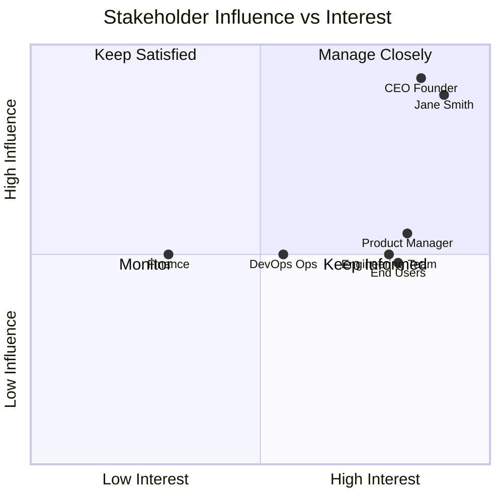
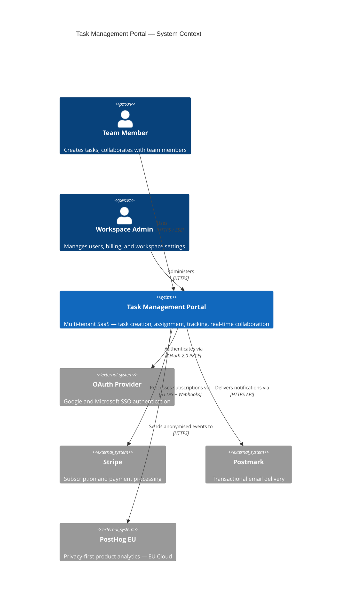
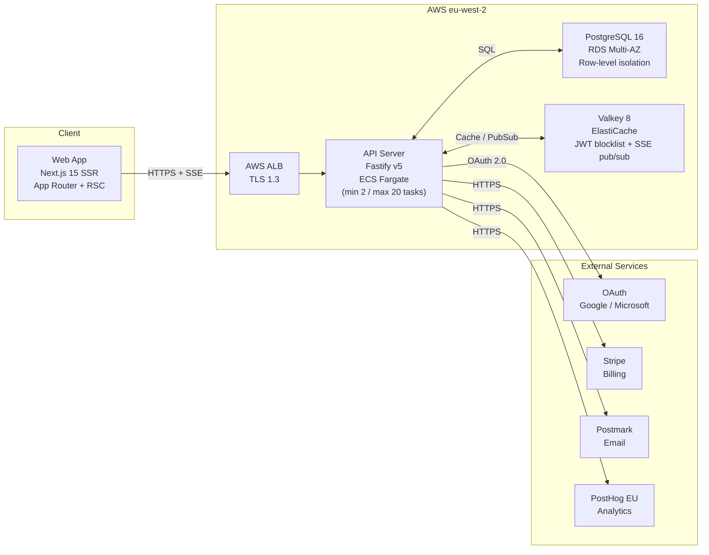
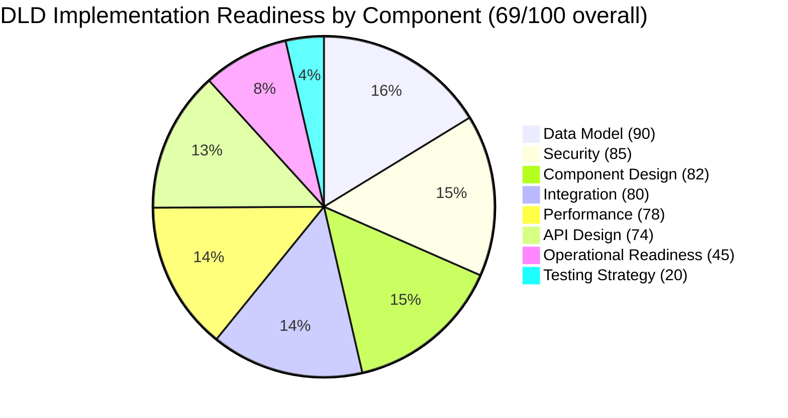
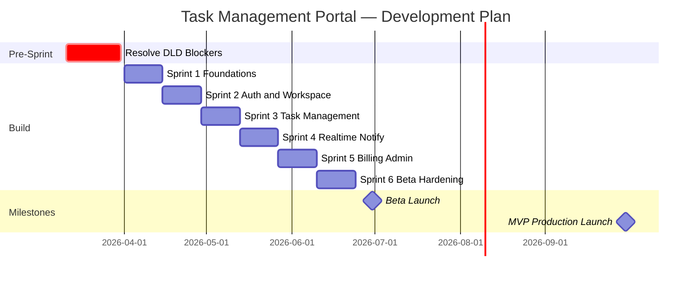

---

marp: true
theme: default
paginate: true
header: 'Task Management Portal — Technical Architecture'
footer: 'ARC-001-PRES-v1.0 | PUBLIC | 2026-03-11'

---

# Task Management Portal

## Technical Architecture Overview

**2026-03-11** | **PUBLIC** | **Version 1.0**

Quento1 Engineering Team

---

## Agenda

1. Context & Objectives
2. Stakeholder Landscape
3. System Context
4. Container Architecture
5. Technology Stack & Key Decisions
6. Data Architecture
7. Security Architecture
8. Requirements Summary
9. Design Review Status
10. Delivery Plan
11. Open Blockers & Next Steps
12. Questions

---

## Context & Objectives

### Business Challenge

Quento1 is building a multi-tenant SaaS task management portal targeting UK SMBs in a market dominated by Jira, Asana, Linear, and Notion. Differentiation strategy: **superior performance and simplicity** — genuinely fast, zero-training adoption.

### Strategic Objectives

- Launch MVP to **100 paying customers** by **30 September 2026**
- Achieve **£180K ARR** within 18 months of production launch
- Keep infrastructure costs below **20% of MRR** at all volume milestones
- Reach **NPS 40+** within 12 months of launch

### Success Criteria

| Metric | Target | Measurement |
|--------|--------|-------------|
| MVP launch | 30 Sept 2026 | Production go-live with 100 paying customers |
| Beta launch | 30 June 2026 | 10+ pilot paying customers |
| API response time | p95 < 200ms | Grafana Cloud p95 latency metric |
| Uptime | 99.9% monthly | AWS CloudWatch availability |
| Engineering cost | < 3-year TCO £389,256 | FinOps tagging and cost allocation |

---

## Stakeholder Landscape

### Key Stakeholders

| Stakeholder | Role | Influence | Interest | Focus |
|-------------|------|-----------|----------|-------|
| CEO / Founder | Executive Sponsor | HIGH | HIGH | Commercial — revenue and market traction |
| Jane Smith | Head of Engineering / Architect | HIGH | HIGH | Architecture integrity, NFR compliance |
| Product Manager | Product Owner | MEDIUM | HIGH | Requirements, sprint reviews |
| Engineering Team | Delivery Team | MEDIUM | HIGH | Implementation, technical debt |
| Operations / DevOps | Infrastructure | MEDIUM | MEDIUM | Deployment, operational readiness |
| End Users | Beneficiary | MEDIUM | HIGH | Usability, performance, NPS |

### Stakeholder Priorities Map

---

## System Context

---

## Container Architecture

> **ADR-001**: SSE chosen over WebSocket for real-time — lower infrastructure cost, ALB native support, sufficient for push-only notification pattern. `ws:workspace:{id}` channel namespace with Redis Streams missed-event replay.

---

## Technology Stack & Key Decisions

| Layer | Technology | Version | Rationale |
|-------|-----------|---------|-----------|
| **Frontend** | Next.js | 15 | SSR + App Router, React Server Components, built-in image/font optimisation |
| **API** | Fastify | v5 | 2.3× Express throughput, native OpenAPI generation via `@fastify/swagger` |
| **Database** | PostgreSQL | 16 RDS Multi-AZ | ACID, row-level isolation for multi-tenancy, PITR, automatic failover |
| **Cache / PubSub** | Valkey | 8 (ElastiCache) | Open-source Redis fork, JWT blocklist, API rate limiting, SSE fan-out |
| **Compute** | ECS Fargate | — | Serverless containers, no EC2 management, IAM task roles |
| **IaC** | OpenTofu | latest | Terraform-compatible OSS, declarative AWS provisioning |
| **CI/CD** | GitHub Actions | — | 8-stage pipeline (lint → test → SAST → build → scan → stage → gate → prod) |
| **Observability** | Grafana Cloud | — | Metrics, logs, traces — SaaS tier, no infra overhead |
| **Analytics** | PostHog EU | — | GDPR-compliant, EU Cloud, feature flags, session replay with `ph-no-capture` |
| **Real-time** | SSE over WebSocket | — | ADR-001: lower cost, ALB compatible, sufficient for push pattern |

**3-year TCO**: £389,256 (£209,256 infrastructure + £180,000 engineering)

---

## Data Architecture

### Entity Model (8 Entities, 74 Attributes, 12 Relationships)

| Entity | Key Attributes | Classification | Notes |
|--------|---------------|----------------|-------|
| **User** | email, display_name, password_hash, totp_secret | CONFIDENTIAL (PII) | bcrypt ≥ 12, TOTP AES-256, soft delete 90-day |
| **Workspace** | name, slug, plan_tier, stripe_customer_id | INTERNAL | Tenant isolation root |
| **WorkspaceMember** | user_id, workspace_id, role | INTERNAL | OWNER / ADMIN / MEMBER |
| **Project** | name, description, workspace_id, archived | INTERNAL | Project container |
| **Task** | title, status, priority, parent_task_id | INTERNAL | Self-referential FK for sub-tasks |
| **Comment** | body, task_id, author_id | INTERNAL | Activity-linked |
| **Notification** | type, recipient_id, read_at | INTERNAL | In-app + email triggers |
| **ActivityLog** | actor_id, action, entity_type, diff_json | INTERNAL | Write-once, DB REVOKE, month-partitioned |

### Key Design Decisions

- **Multi-tenancy**: Row-level isolation via `workspace_id` FK on all tenant-scoped tables — no separate schema per tenant
- **Immutability**: ActivityLog enforced write-once at DB level via `REVOKE UPDATE, DELETE` on application role
- **GDPR**: PII fields isolated to User entity; DPIA required before production (Art. 35); DPO appointment pending
- **Sub-tasks**: Self-referential `parent_task_id FK` (nullable) — single table design, two-level hierarchy for MVP

---

## Security Architecture

### Defence-in-Depth Controls

| Layer | Control | Implementation |
|-------|---------|----------------|
| **Authentication** | JWT RS256 + refresh tokens | Asymmetric keys, 15-min access / 7-day refresh |
| **Session invalidation** | JWT blocklist | Valkey (ElastiCache) `jti` revocation store |
| **Authorisation** | RBAC dual-layer | Fastify middleware (route-level) + PostgreSQL role (DB-level) |
| **Secrets** | AWS Secrets Manager | 30-day automatic rotation for all credentials |
| **Transport** | TLS 1.3 | ACM certificates, HSTS enforced on ALB |
| **Encryption** | AES-256 | TOTP secrets at rest; RDS encryption via AWS KMS |
| **Audit** | Immutable ActivityLog | Write-once, month-partitioned, DB-level REVOKE |
| **Analytics privacy** | PostHog anonymisation | UUID `distinct_id`, CSS `ph-no-capture` on PII fields |
| **Vulnerability** | OWASP mitigations | Parameterised SQL (Kysely), `helmet.js`, rate limiting via Valkey |

### Compliance Posture

- **Data residency**: AWS eu-west-2 + PostHog EU Cloud — UK/EU GDPR data sovereignty ✅
- **NFR-C-001**: GDPR compliant architecture; DPIA in progress (Art. 35 required)
- **NFR-SEC-001–006**: Authentication, authorisation, encryption, secrets management, OWASP mitigations all addressed in HLD

---

## Requirements Summary

### Requirements by Category

| Category | Count | MoSCoW Distribution | Key Critical Items |
|----------|-------|---------------------|-------------------|
| Business Requirements (BR) | 4 | 4 MUST | Launch MVP, £180K ARR, infra cost < 20% MRR, NPS 40+ |
| Functional Requirements (FR) | 26 | 20 MUST / 4 SHOULD / 2 COULD | Auth, task CRUD, sub-tasks, RBAC, notifications, export |
| Non-Functional Requirements (NFR) | 28 | 18 MUST / 7 SHOULD / 3 COULD | Performance, availability, security, compliance |
| Integration Requirements (INT) | 5 | 4 MUST / 1 SHOULD | Email, OAuth, Stripe, PostHog, AWS |
| Data Requirements (DR) | 10 | 8 MUST / 2 SHOULD | 8 core entities + migration + quality standards |
| **Total** | **73** | — | — |

### Critical NFRs

| ID | Requirement | Target | Status |
|----|-------------|--------|--------|
| NFR-P-001 | API core action response time | p95 < 200ms | Designed — Fastify + Valkey cache |
| NFR-A-001 | Monthly uptime SLA | 99.9% | Designed — RDS Multi-AZ + ECS auto-scaling |
| NFR-A-002 | Recovery objectives | RTO < 30 min, RPO < 1 hr | Resolved in HLDR v1.1 — Multi-AZ failover < 15 min |
| NFR-SEC-001 | Authentication | JWT RS256 + MFA | Designed — implemented in DIAG-001 |
| NFR-C-001 | GDPR compliance | UK GDPR Art. 5, 6, 17, 25 | In progress — DPIA pending |

---

## Design Review Status

### Review Outcomes

| Review | Artefact | Status | Score | Open Blockers |
|--------|---------|--------|-------|---------------|
| HLD Review (HLDR v1.1) | ARC-001-DIAG-001-v1.0 | **APPROVED WITH CONDITIONS** | — | 2 open |
| DLD Review (DLDR v1.0) | DIAG-001 + DATA + DFD + ADR | **APPROVED WITH CONDITIONS** | 69/100 | 5 open |

### DLD Component Scores

> Operational Readiness (45/100) and Testing Strategy (20/100) are the critical weak dimensions — both are DLD blocking conditions requiring resolution before Sprint 1.

---

## Delivery Plan

### Key Milestones

| Milestone | Target Date | Status | Dependencies |
|-----------|------------|--------|--------------|
| Blockers resolved | 2026-03-31 | At Risk | 5 DLD blocking conditions |
| Sprint 1 start | 2026-04-01 | Pending | All 5 blockers resolved |
| Beta launch | 2026-06-30 | On Track (conditional) | Sprint 1–6 complete |
| MVP production | 2026-09-30 | On Track (conditional) | Beta cohort + post-beta hardening |
| £180K ARR | 2027-03-30 | Planned | MVP live, customer acquisition |

---

## Open Blockers & Next Steps

### DLD Blocking Conditions (Must Resolve Before Sprint 1)

| ID | Blocker | Effort | Owner | Target |
|----|---------|--------|-------|--------|
| DLD-BLOCKING-01 | Enable ElastiCache Multi-AZ replication group | Low — OpenTofu config change | DevOps | 2026-03-17 |
| DLD-BLOCKING-02 | Design observability architecture (SLIs, SLOs, OpenTelemetry, Grafana dashboards, runbooks) | Medium | Lead Architect + SRE | 2026-03-24 |
| DLD-BLOCKING-03 | Commit versioned OpenAPI 3.0 spec from `@fastify/swagger` as artefact | Low — generate + commit | Backend Lead | 2026-03-17 |
| DLD-BLOCKING-04 | Document test strategy (Vitest, Supertest + Testcontainers, Playwright, k6, OWASP ZAP) | Medium | QA Lead | 2026-03-24 |
| DLD-BLOCKING-05 | Define zero-downtime PostgreSQL migration strategy (tool, naming convention, expand-contract patterns, CI gate) | Medium | Backend Lead | 2026-03-24 |

### Recommended Next ArcKit Commands

| Command | Purpose | Priority |
|---------|---------|---------|
| `/arckit:devops` | CI/CD pipeline design, IaC workflow, container strategy — directly addresses BLOCKING-02/04/05 | **Immediate** |
| `/arckit:backlog` | Translate 26 FRs into sprint-ready user stories with acceptance criteria | After blockers |
| `/arckit:dpia` | GDPR Article 35 DPIA — required before production launch (User entity PII) | After backlog |
| `/arckit:operationalize` | Runbooks, SLA definitions, incident response — required for Beta readiness | Sprint 5 |

---

## Questions & Discussion

### Architecture Decisions Open for Review

1. **ElastiCache tier selection**: Single node sufficient for Year 1? Or provision cluster mode from day one?
2. **Observability tooling**: Grafana Cloud vs AWS-native (CloudWatch + X-Ray) — cost vs operational simplicity?
3. **Migration tooling**: Flyway vs Liquibase vs custom scripts for PostgreSQL schema migrations?

**Contact**: Jane Smith, Head of Engineering
**Document**: `ARC-001-PRES-v1.0.md`
**Next Review**: 2026-04-11

**Source Artefacts**: ARC-001-STKE-v1.0, ARC-001-REQ-v1.1, ARC-001-RSCH-v1.0, ARC-001-DATA-v1.0,
ARC-001-DIAG-001-v1.0, ARC-001-DFD-001-v1.0, ARC-001-ADR-001-v1.0,
ARC-001-HLDR-v1.0, ARC-001-DLDR-v1.0, ARC-000-PRIN-v1.0

---