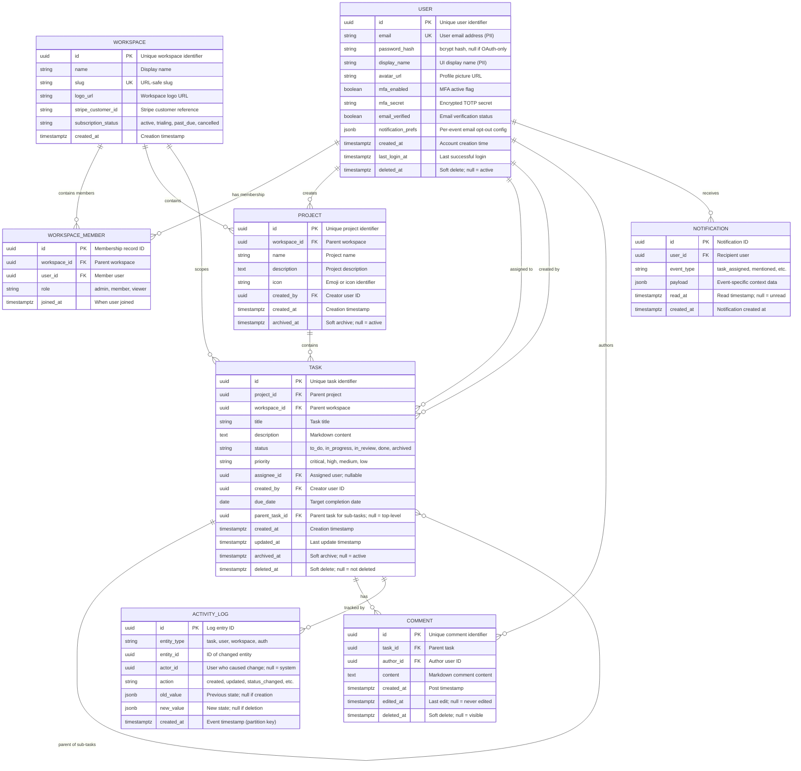

# Data Model: Task Management Portal

> **Template Origin**: Official | **ArcKit Version**: 4.1.1 | **Command**: `/arckit:data-model`

## Document Control

| Field | Value |
|-------|-------|
| **Document ID** | ARC-001-DATA-v1.0 |
| **Document Type** | Data Model |
| **Project** | Task Management Portal (Project 001) |
| **Classification** | PUBLIC |
| **Status** | DRAFT |
| **Version** | 1.0 |
| **Created Date** | 2026-03-10 |
| **Last Modified** | 2026-03-10 |
| **Review Cycle** | Monthly |
| **Next Review Date** | 2026-04-10 |
| **Owner** | Jane Smith, Head of Engineering |
| **Reviewed By** | PENDING |
| **Approved By** | PENDING |
| **Distribution** | Engineering, Product, Leadership, and Operations Teams |

## Revision History

| Version | Date | Author | Changes | Approved By | Approval Date |
|---------|------|--------|---------|-------------|---------------|
| 1.0 | 2026-03-10 | ArcKit AI | Initial creation from `/arckit:data-model` command | PENDING | PENDING |

---

## Executive Summary

### Overview

This data model defines the authoritative entity structure for Quento1's Task Management Portal — a SaaS platform enabling teams to create, assign, and track tasks within shared workspaces. The model is derived directly from data requirements DR-001 through DR-009 in ARC-001-REQ-v1.1 and is aligned with the 16 Quento1 architecture principles in ARC-000-PRIN-v1.0, particularly Principle 6 (Data Sovereignty and Governance), Principle 7 (Data Quality and Lineage), and Principle 8 (Single Source of Truth).

The model comprises eight entities organised across two bounded contexts: **Identity and Access** (User, Workspace, WorkspaceMember) and **Work Management** (Project, Task, Comment, Notification, ActivityLog). The Task entity is central to the model and employs a self-referential foreign key (`parent_task_id`) to support the sub-task requirement (UC-5, DR-003, DR-008a) without a separate table, enforcing a maximum nesting depth of one level at the application layer.

Privacy is a first-class concern. The User entity (E-001) contains PII (email address and display name) under UK GDPR / EU GDPR. All other entities are classified INTERNAL and contain no direct PII. A GDPR Data Protection Impact Assessment (DPIA) is required before production launch due to personal data processing. Data residency is restricted to UK/EU cloud regions per NFR-C-001 and Architecture Principle 6.

### Model Statistics

- **Total Entities**: 8 entities defined (E-001 through E-008)
- **Total Attributes**: 74 attributes across all entities
- **Total Relationships**: 12 relationships mapped
- **Data Classification**:
  - Public: 0 entities
  - Internal: 7 entities
  - Confidential: 1 entity (E-001: User — contains PII)
  - Restricted: 0 entities

### Compliance Summary

- **GDPR/DPA 2018 Status**: COMPLIANT (controls in place; DPIA required before launch)
- **PII Entities**: 1 entity contains personally identifiable information (E-001: User)
- **Data Protection Impact Assessment (DPIA)**: REQUIRED (personal data processed at scale for SaaS service; DPIA must be completed before production launch per GDPR Art. 35)
- **Data Retention**: 90 days (post-cancellation User deletion) to 3 years (ActivityLog hot storage)
- **Cross-Border Transfers**: Controlled — UK/EU data residency enforced; third-party processors (email, analytics) governed by Standard Contractual Clauses

### Key Data Governance Stakeholders

- **Data Owner (Business)**: CEO / Founder — accountable for data usage policy and commercial data decisions
- **Data Steward**: Jane Smith, Head of Engineering — responsible for data governance, quality standards, and GDPR compliance
- **Data Custodian (Technical)**: Engineering / DevOps Team — manages database infrastructure, backups, encryption
- **Data Protection Officer**: PENDING appointment (required before production launch per GDPR Art. 37 if processing at scale)

---

## Visual Entity-Relationship Diagram (ERD)

**Diagram Notes**:

- **Cardinality**: `||` = exactly one, `o{` = zero or more, `|{` = one or more
- **Self-referential Task**: `TASK ||--o{ TASK` represents the sub-task relationship via `parent_task_id`; maximum depth enforced at application layer (not DB constraint)
- **PII**: `email` and `display_name` in USER entity are PII; all other attributes are non-personal
- **Soft deletes**: `deleted_at` / `archived_at` timestamps are used throughout; hard deletes occur only after retention periods

---

## Entity Catalog

### Entity E-001: User

**Description**: Represents an authenticated Quento1 platform user account. Central identity entity — referenced by all other entities that track actor, assignee, or author context.

**Source Requirements**:

- DR-001: User Entity
- FR-001: User Registration
- FR-002: User Authentication and Session Management
- FR-003: User Profile Management
- NFR-SEC-001: Authentication
- NFR-C-001: GDPR Compliance

**Business Context**: Every person who accesses the Task Management Portal has exactly one User record. Users authenticate via email/password or OAuth (Google, Microsoft), and belong to one or more Workspaces via the WorkspaceMember junction entity (E-003). User records are the basis for all RBAC decisions and all activity attribution.

**Data Ownership**:

- **Business Owner**: CEO / Founder — accountable for user data policy, retention decisions, and erasure request authorisation
- **Technical Owner**: Engineering Team — maintains schema, indexes, and encryption controls
- **Data Steward**: Jane Smith, Head of Engineering — enforces GDPR compliance, manages DPO liaison, approves subject access requests

**Data Classification**: CONFIDENTIAL (contains PII: email, display_name)

**Volume Estimates**:

- **Initial Volume**: 500 records at go-live (Year 1 estimate)
- **Growth Rate**: +50 records per month (100 customers × 5 users avg)
- **Peak Volume**: 5,000 records at Year 3
- **Average Record Size**: 1–2 KB per record

**Data Retention**:

- **Active Period**: Retained while subscription is active
- **Post-Cancellation Window**: Soft-deleted (`deleted_at` set); data retained 90 days for account recovery
- **Hard Deletion**: 90 days after `deleted_at` — all PII permanently deleted; task content created by user is anonymised (creator reference replaced with "Deleted User" pseudonym)
- **Legal Basis**: Data retained as long as necessary to fulfil the service contract (GDPR Art. 6(1)(b))

#### Attributes

| Attribute | Type | Required | PII | Description | Validation Rules | Default | Source Req |
|-----------|------|----------|-----|-------------|------------------|---------|------------|
| id | UUID | Yes | No | Unique user identifier | UUID v4, auto-generated | Auto | DR-001 |
| email | VARCHAR(320) | Yes | Yes | User email address | RFC 5322 format; lowercase; unique; indexed | None | DR-001 |
| password_hash | VARCHAR(72) | No | No | bcrypt password hash | bcrypt cost factor min 12; null if OAuth-only | NULL | FR-001 |
| display_name | VARCHAR(100) | Yes | Yes | Name shown in UI across tasks and comments | Non-empty; 1–100 chars | None | DR-001 |
| avatar_url | VARCHAR(2048) | No | No | Profile picture URL (object storage) | Valid URL or NULL | NULL | FR-003 |
| mfa_enabled | BOOLEAN | Yes | No | Whether MFA is active | true/false | false | NFR-SEC-001 |
| mfa_secret | VARCHAR(32) | No | No | Encrypted TOTP secret (AES-256) | 32-char base32; null if MFA disabled | NULL | NFR-SEC-001 |
| email_verified | BOOLEAN | Yes | No | Whether email has been verified | true/false | false | FR-001 |
| notification_prefs | JSONB | Yes | No | Per-event email opt-out flags | JSON object with boolean per event type | All enabled | FR-003 |
| created_at | TIMESTAMPTZ | Yes | No | Account creation timestamp | ISO 8601 UTC; auto-set on insert | NOW() | DR-001 |
| last_login_at | TIMESTAMPTZ | No | No | Last successful authentication | ISO 8601 UTC; updated on each successful login | NULL | DR-001 |
| deleted_at | TIMESTAMPTZ | No | No | Soft delete timestamp (null = active) | ISO 8601 UTC; set on account cancellation | NULL | NFR-C-001 |

**Attribute Notes**:

- **PII Attributes**: `email`, `display_name` — require encryption at rest, access audit logging, and data subject rights implementation
- **Encrypted Attributes**: `mfa_secret` — AES-256 encrypted at field level within the database; encryption key managed via cloud KMS
- **Derived Attributes**: None; all attributes are stored values
- **Audit Attributes**: `created_at`, `last_login_at`, `deleted_at` — not editable by users; set/updated by system

#### Relationships

**Outgoing Relationships** (this entity references others):

- None — User is a root entity in the identity graph; all relationships are incoming

**Incoming Relationships** (other entities reference this):

- **Workspace membership**: E-003 (WorkspaceMember) → E-001 via `user_id` — a User can belong to many Workspaces
- **Project creator**: E-004 (Project) → E-001 via `created_by` — a User can create many Projects
- **Task assignee**: E-005 (Task) → E-001 via `assignee_id` — a User can be assigned many Tasks
- **Task creator**: E-005 (Task) → E-001 via `created_by` — a User can create many Tasks
- **Comment author**: E-006 (Comment) → E-001 via `author_id` — a User can author many Comments
- **Notification recipient**: E-007 (Notification) → E-001 via `user_id` — a User can receive many Notifications
- **Activity actor**: E-008 (ActivityLog) → E-001 via `actor_id` (nullable — null for system events)

#### Indexes

**Primary Key**:

- `pk_user` on `id` (clustered)

**Unique Constraints**:

- `uk_user_email` on `email` (case-insensitive; enforced via function index on `LOWER(email)`)

**Performance Indexes**:

- `idx_user_created_at` on `created_at` (for admin user listing and reporting)
- `idx_user_last_login_at` on `last_login_at` (for inactive user reporting)
- `idx_user_deleted_at` on `deleted_at` (partial index: `WHERE deleted_at IS NULL` for active user queries)

**Full-Text Indexes**:

- `ftx_user_display_name` on `display_name` (for @mention autocomplete search)

#### Privacy & Compliance

**GDPR/UK GDPR Considerations**:

- **Contains PII**: YES
- **PII Attributes**: `email` (direct identifier), `display_name` (indirect identifier — typically a real name)
- **Legal Basis for Processing**: Contract — GDPR Art. 6(1)(b): processing necessary to perform the SaaS service contract with the user
- **Data Subject Rights**:
  - **Right to Access**: User data exported via `GET /api/v1/account/data-export` — returns all User attributes in JSON; available immediately, MFA re-authentication required
  - **Right to Rectification**: Users update `display_name`, `email`, `avatar_url`, `notification_prefs` via `PATCH /api/v1/account/profile`; email changes require re-verification
  - **Right to Erasure**: User submits deletion request via account settings → `deleted_at` set immediately (access revoked); hard delete of PII fields after 90-day recovery window; `display_name` on Tasks/Comments replaced with "Deleted User"
  - **Right to Portability**: `GET /api/v1/account/data-export` returns JSON containing all user-provided data
  - **Right to Object**: Not applicable (processing basis is contract, not legitimate interest)
  - **Right to Restrict Processing**: `email_verified = false` effectively restricts processing; explicit restriction flag can be added if required by DPO
- **Data Breach Impact**: HIGH — email addresses exposed at scale constitute a significant GDPR breach requiring ICO notification within 72 hours
- **Cross-Border Transfers**: Primary DB in UK/EU cloud region; email provider (AWS SES, SendGrid) processes email under Standard Contractual Clauses
- **DPIA**: REQUIRED — processing of personal data for a SaaS service with 500+ users at scale

**Sector-Specific Compliance**:

- **PCI-DSS**: NOT APPLICABLE — User entity stores no payment card data; Stripe handles all card data
- **HIPAA**: NOT APPLICABLE — no healthcare data
- **FCA Regulations**: NOT APPLICABLE — not a financial services product

**Audit Logging**:

- **Access Logging**: REQUIRED — all reads of User PII fields (admin access) logged to ActivityLog (E-008)
- **Change Logging**: REQUIRED — all modifications to User attributes logged with before/after values
- **Retention of Logs**: 1 year hot storage; 2 years cold storage per NFR-C-002

---

### Entity E-002: Workspace

**Description**: Top-level organisational container in the Quento1 platform. Represents a company or team that has subscribed to the service. All Projects and Tasks belong to a Workspace. Workspaces are isolated from one another — no cross-workspace data sharing.

**Source Requirements**:

- DR-002: Workspace Entity
- FR-004: Workspace Management
- FR-021: Subscription and Billing Management
- INT-003: Payment Processing (Stripe)
- BR-002: Generate £180K ARR

**Business Context**: Each paying customer is represented by one Workspace. The Workspace holds the Stripe subscription reference (`stripe_customer_id`) and the current billing status. When a subscription lapses, the Workspace and all its data enter a grace period, after which they are archived and eventually deleted.

**Data Ownership**:

- **Business Owner**: CEO / Founder — subscription revenue data; decisions on workspace archival policy
- **Technical Owner**: Engineering Team — database schema, Stripe webhook handling
- **Data Steward**: Jane Smith, Head of Engineering

**Data Classification**: INTERNAL

**Volume Estimates**:

- **Initial Volume**: 100 records at go-live (100 paying customers = 100 Workspaces)
- **Growth Rate**: +50 per month
- **Peak Volume**: 1,000 records at Year 3
- **Average Record Size**: 0.5 KB

**Data Retention**:

- **Active Period**: Retained while subscription is active or in grace period
- **Post-Cancellation**: Workspace data retained 90 days (aligned with User retention per NFR-C-001); then soft-archived
- **Hard Deletion**: After 90 days, all workspace data (Projects, Tasks, Comments) is cascade-deleted

#### Attributes

| Attribute | Type | Required | PII | Description | Validation Rules | Default | Source Req |
|-----------|------|----------|-----|-------------|------------------|---------|------------|
| id | UUID | Yes | No | Unique workspace identifier | UUID v4, auto-generated | Auto | DR-002 |
| name | VARCHAR(100) | Yes | No | Workspace display name | Non-empty; 1–100 chars | None | DR-002 |
| slug | VARCHAR(50) | Yes | No | URL-safe unique identifier | Lowercase alphanumeric + hyphens; unique; immutable after 24 hours | None | FR-004 |
| logo_url | VARCHAR(2048) | No | No | Workspace logo URL | Valid URL or NULL | NULL | FR-004 |
| stripe_customer_id | VARCHAR(50) | No | No | Stripe customer reference | Stripe customer ID format (cus_xxx) or NULL | NULL | INT-003 |
| subscription_status | ENUM | Yes | No | Current billing status | One of: active, trialing, past_due, cancelled | trialing | FR-021 |
| created_at | TIMESTAMPTZ | Yes | No | Creation timestamp | ISO 8601 UTC; auto-set | NOW() | DR-002 |

#### Relationships

**Incoming Relationships**:

- **Members**: E-003 (WorkspaceMember) → E-002 via `workspace_id` — a Workspace has many Members
- **Projects**: E-004 (Project) → E-002 via `workspace_id` — a Workspace contains many Projects
- **Tasks**: E-005 (Task) → E-002 via `workspace_id` — a Workspace scopes many Tasks (denormalised for performance)

#### Indexes

**Primary Key**:

- `pk_workspace` on `id`

**Unique Constraints**:

- `uk_workspace_slug` on `slug`
- `uk_workspace_stripe_customer_id` on `stripe_customer_id` (partial: `WHERE stripe_customer_id IS NOT NULL`)

**Performance Indexes**:

- `idx_workspace_subscription_status` on `subscription_status` (for billing reports and grace period jobs)
- `idx_workspace_created_at` on `created_at`

#### Privacy & Compliance

- **Contains PII**: NO — Workspace name and slug are company identifiers, not personal data
- **Legal Basis**: Contract — processing necessary to provide the subscribed service
- **Audit Logging**: REQUIRED for `subscription_status` changes (billing events)

---

### Entity E-003: WorkspaceMember

**Description**: Junction entity linking Users to Workspaces with a specific role. Implements the RBAC model: Admin, Member, or Viewer at the workspace level, as required by FR-005. A user can belong to multiple Workspaces with different roles in each.

**Source Requirements**:

- FR-005: Role-Based Access Control Within Workspace
- FR-020: Workspace Admin Panel — User Management
- NFR-SEC-002: Authorisation

**Business Context**: Access control decisions for all workspace resources (Projects, Tasks, Comments) are evaluated against WorkspaceMember role. Server-side enforcement on every API request per NFR-SEC-002 (Zero Trust, Least Privilege). UI controls are supplementary.

**Data Ownership**:

- **Business Owner**: CEO / Founder — access policy decisions
- **Technical Owner**: Engineering Team — RBAC enforcement layer

**Data Classification**: INTERNAL

**Volume Estimates**:

- **Initial Volume**: 500 records (100 workspaces × 5 users avg)
- **Growth Rate**: +250 per month
- **Peak Volume**: 15,000 records at Year 3

**Data Retention**:

- Retained while the User is active in the Workspace
- Deleted on User removal from Workspace (FR-020) or on User account deletion

#### Attributes

| Attribute | Type | Required | PII | Description | Validation Rules | Default | Source Req |
|-----------|------|----------|-----|-------------|------------------|---------|------------|
| id | UUID | Yes | No | Membership record ID | UUID v4, auto-generated | Auto | FR-005 |
| workspace_id | UUID | Yes | No | Parent workspace | FK → Workspace(id); indexed | None | FR-005 |
| user_id | UUID | Yes | No | Member user | FK → User(id); indexed | None | FR-005 |
| role | ENUM | Yes | No | Role within workspace | One of: admin, member, viewer | member | FR-005 |
| joined_at | TIMESTAMPTZ | Yes | No | When the membership was established | ISO 8601 UTC; auto-set | NOW() | FR-005 |

#### Relationships

**Outgoing Relationships**:

- Many-to-one: E-003 → E-002 (Workspace) via `workspace_id`
- Many-to-one: E-003 → E-001 (User) via `user_id`

#### Indexes

**Primary Key**:

- `pk_workspace_member` on `id`

**Unique Constraints**:

- `uk_workspace_member_user` on `(workspace_id, user_id)` — one membership record per user per workspace

**Performance Indexes**:

- `idx_workspace_member_workspace_id` on `workspace_id` (for listing workspace members)
- `idx_workspace_member_user_id` on `user_id` (for listing user's workspaces)
- `idx_workspace_member_role` on `(workspace_id, role)` (for finding all admins in a workspace)

#### Privacy & Compliance

- **Contains PII**: NO — role assignment data; no personal attributes stored
- **Audit Logging**: REQUIRED — role changes and membership additions/removals logged to E-008

---

### Entity E-004: Project

**Description**: An organisational container within a Workspace for grouping related Tasks. Projects support both List and Kanban views (FR-014). A Workspace can have many Projects; Tasks belong to exactly one Project.

**Source Requirements**:

- DR-004: Project Entity
- FR-013: Project Management
- FR-014: Project Views — List and Kanban
- FR-015: Project Member Management

**Business Context**: Projects map to actual team projects or epics. Team Leads use Projects to organise work and track aggregate progress. The `archived_at` soft-delete enables historical Projects to be preserved for audit purposes while hidden from the default view.

**Data Ownership**:

- **Business Owner**: Product Manager — project structure and lifecycle policy
- **Technical Owner**: Engineering Team

**Data Classification**: INTERNAL

**Volume Estimates**:

- **Initial Volume**: 500 records (100 workspaces × 5 projects avg)
- **Growth Rate**: +100 per month
- **Peak Volume**: 5,000 records at Year 3

**Data Retention**:

- Active Projects retained indefinitely while Workspace subscription is active
- Archived Projects retained in soft-deleted state for the lifetime of the Workspace
- Hard-deleted 90 days after Workspace cancellation

#### Attributes

| Attribute | Type | Required | PII | Description | Validation Rules | Default | Source Req |
|-----------|------|----------|-----|-------------|------------------|---------|------------|
| id | UUID | Yes | No | Unique project identifier | UUID v4, auto-generated | Auto | DR-004 |
| workspace_id | UUID | Yes | No | Parent workspace | FK → Workspace(id); indexed | None | DR-004 |
| name | VARCHAR(100) | Yes | No | Project name | Non-empty; 1–100 chars | None | DR-004 |
| description | TEXT | No | No | Project description | Max 5,000 chars | NULL | DR-004 |
| icon | VARCHAR(50) | No | No | Emoji or icon identifier | Nullable; single emoji or icon code | NULL | FR-013 |
| created_by | UUID | Yes | No | Creator user ID | FK → User(id) | None | DR-004 |
| created_at | TIMESTAMPTZ | Yes | No | Creation timestamp | ISO 8601 UTC; auto-set | NOW() | DR-004 |
| archived_at | TIMESTAMPTZ | No | No | Archive timestamp; null = active | ISO 8601 UTC | NULL | FR-013 |

#### Relationships

**Outgoing Relationships**:

- Many-to-one: E-004 → E-002 (Workspace) via `workspace_id` (CASCADE delete if Workspace deleted)
- Many-to-one: E-004 → E-001 (User) via `created_by` (SET NULL on User deletion)

**Incoming Relationships**:

- Tasks: E-005 (Task) → E-004 via `project_id` — a Project contains many Tasks

#### Indexes

**Primary Key**:

- `pk_project` on `id`

**Performance Indexes**:

- `idx_project_workspace_id` on `workspace_id` (for listing workspace projects)
- `idx_project_created_by` on `created_by`
- `idx_project_active` on `workspace_id` (partial: `WHERE archived_at IS NULL` — active project queries)

#### Privacy & Compliance

- **Contains PII**: NO
- **Audit Logging**: REQUIRED for archival and deletion events

---

### Entity E-005: Task

**Description**: Core entity of the platform. Represents a discrete unit of work within a Project. Supports self-referential parent/child relationship for sub-tasks (parent_task_id). Tasks progress through a configurable status workflow and are central to all user journeys (UC-1 through UC-5).

**Source Requirements**:

- DR-003: Task Entity
- DR-008a: Sub-Task Considerations
- FR-006: Task Creation
- FR-007: Task Editing
- FR-008: Task Status Workflow
- FR-009: Task Deletion and Archiving
- FR-023: Sub-Task Creation
- FR-024: Sub-Task Status Management
- FR-025: Sub-Task Assignment and Notifications
- FR-026: Sub-Task Progress Display

**Business Context**: Tasks are the primary value delivery mechanism. Every functional requirement (task creation, assignment, prioritisation, commenting, sub-tasks) ultimately reads or writes to this entity. The self-referential `parent_task_id` enables sub-tasks (UC-5) to be stored in the same table with a one-level nesting constraint enforced at the application layer. Sub-task progress counters are computed at query time and cached in Redis for Kanban view performance (DR-008a).

**Data Ownership**:

- **Business Owner**: Product Manager — task lifecycle, status workflow definition
- **Technical Owner**: Engineering Team — schema, indexing strategy, soft-delete and archival jobs
- **Data Steward**: Jane Smith, Head of Engineering — data quality standards per DR-009

**Data Classification**: INTERNAL

**Volume Estimates**:

- **Initial Volume**: 100,000 records at Year 1 (including ~20,000 sub-task records)
- **Growth Rate**: +20,000 records per month at Year 1 scale
- **Peak Volume**: 2,000,000 records at Year 3 (NFR-S-002)
- **Average Record Size**: 5–15 KB per record (depends on description length)
- **Note**: Requires database partitioning (by `workspace_id` or time) at Year 2+ scale to maintain query performance

**Data Retention**:

- Active Tasks: Retained indefinitely while Workspace subscription is active
- Archived Tasks (`archived_at` set): Visible in Archive section for 30 days (FR-009); eligible for cold storage migration after 12 months (NFR-S-002)
- Soft-deleted Tasks (`deleted_at` set): Cascade-deleted within 24 hours (background job, FR-009)
- Hard Deletion: On Workspace cancellation, cascade within 90 days

#### Attributes

| Attribute | Type | Required | PII | Description | Validation Rules | Default | Source Req |
|-----------|------|----------|-----|-------------|------------------|---------|------------|
| id | UUID | Yes | No | Unique task identifier | UUID v4, auto-generated | Auto | DR-003 |
| project_id | UUID | Yes | No | Parent project | FK → Project(id); indexed | None | DR-003 |
| workspace_id | UUID | Yes | No | Parent workspace (denormalised) | FK → Workspace(id); indexed | None | DR-003 |
| title | VARCHAR(500) | Yes | No | Task title | Non-empty; 1–500 chars | None | DR-003, FR-006 |
| description | TEXT | No | No | Markdown content | Max 50,000 chars | NULL | DR-003 |
| status | ENUM | Yes | No | Workflow status | One of: to_do, in_progress, in_review, done, archived | to_do | DR-003 |
| priority | ENUM | Yes | No | Importance level | One of: critical, high, medium, low | medium | DR-003 |
| assignee_id | UUID | No | No | Assigned user; null = unassigned | FK → User(id); nullable; indexed | NULL | DR-003 |
| created_by | UUID | Yes | No | Creator user ID | FK → User(id); indexed | None | DR-003 |
| due_date | DATE | No | No | Target completion date | Valid calendar date; nullable | NULL | DR-003 |
| parent_task_id | UUID | No | No | Parent task ID for sub-tasks; null = top-level task | FK → Task(id); nullable; indexed; parent must have parent_task_id = NULL (enforced at app layer) | NULL | DR-003, DR-008a |
| created_at | TIMESTAMPTZ | Yes | No | Creation timestamp | ISO 8601 UTC; auto-set | NOW() | DR-003 |
| updated_at | TIMESTAMPTZ | Yes | No | Last update timestamp | ISO 8601 UTC; auto-updated on every write | NOW() | DR-003 |
| archived_at | TIMESTAMPTZ | No | No | Archive timestamp; null = active | ISO 8601 UTC | NULL | FR-009 |
| deleted_at | TIMESTAMPTZ | No | No | Soft delete timestamp | ISO 8601 UTC | NULL | FR-009 |

**Attribute Notes**:

- **Self-referential constraint**: Application layer checks `parent_task_id IS NULL` on the proposed parent before allowing a sub-task INSERT. If the parent itself has a non-null `parent_task_id`, the operation is rejected with error `NESTING_DEPTH_EXCEEDED`
- **Sub-task progress**: Computed at query time (`COUNT(*) WHERE parent_task_id = :id AND deleted_at IS NULL`) and cached in Redis with a 5-second TTL per DR-008a — not stored as a column
- **Sub-task cascade**: When a parent task is archived or soft-deleted, a background job archives/deletes all child Tasks (WHERE `parent_task_id = :parent_id`)

#### Relationships

**Outgoing Relationships**:

- Many-to-one: E-005 → E-004 (Project) via `project_id` — RESTRICT on delete (tasks must be moved or deleted before project archival)
- Many-to-one: E-005 → E-002 (Workspace) via `workspace_id` — CASCADE soft-delete on Workspace deletion
- Many-to-one: E-005 → E-001 (User) via `assignee_id` — SET NULL on User deletion
- Many-to-one: E-005 → E-001 (User) via `created_by` — SET NULL on User deletion (creator anonymised)
- Self-referential: E-005 → E-005 via `parent_task_id` — CASCADE archive/delete on parent archival/deletion

**Incoming Relationships**:

- Comments: E-006 (Comment) → E-005 via `task_id` — a Task has many Comments
- Activity Logs: E-008 (ActivityLog) with `entity_type = 'task'` and `entity_id = task.id`

#### Indexes

**Primary Key**:

- `pk_task` on `id`

**Foreign Keys**:

- `fk_task_project` on `project_id` → Project(id)
- `fk_task_workspace` on `workspace_id` → Workspace(id)
- `fk_task_assignee` on `assignee_id` → User(id); ON DELETE SET NULL
- `fk_task_created_by` on `created_by` → User(id); ON DELETE SET NULL
- `fk_task_parent` on `parent_task_id` → Task(id); ON DELETE CASCADE

**Unique Constraints**: None (task titles are not required to be unique)

**Performance Indexes**:

- `idx_task_project_status` on `(project_id, status)` — primary Kanban board query
- `idx_task_assignee_status` on `(assignee_id, status)` — personal dashboard query
- `idx_task_workspace_due_date` on `(workspace_id, due_date)` — overdue task queries
- `idx_task_parent_task_id` on `parent_task_id` — sub-task retrieval
- `idx_task_top_level` on `project_id` (partial: `WHERE parent_task_id IS NULL AND deleted_at IS NULL`) — optimised top-level task listing
- `idx_task_updated_at` on `updated_at` — for activity feeds and recent task listings
- `idx_task_active` on `workspace_id` (partial: `WHERE deleted_at IS NULL AND archived_at IS NULL`) — active task scans

**Full-Text Indexes**:

- `ftx_task_title_description` on `(title, description)` — powers FR-010 keyword search

#### Privacy & Compliance

- **Contains PII**: NO — Task titles and descriptions may contain names incidentally (user-generated content), but Task is not classified as a PII entity; `assignee_id` and `created_by` are UUIDs (pseudonymous references)
- **Legal Basis**: Contract — processing task data is the core purpose of the service
- **Right to Erasure**: On User deletion, `assignee_id` → SET NULL; `created_by` → SET NULL; UI renders "Deleted User" where applicable. Task content itself is NOT deleted (preserves project integrity per NFR-C-001)
- **Audit Logging**: All Task mutations logged to E-008 (ActivityLog) — mandatory per FR-012

---

### Entity E-006: Comment

**Description**: User-authored comments attached to Tasks. Supports Markdown formatting and @mention syntax. Comments are the primary collaboration mechanism within tasks. Soft-deleted records are hidden from the UI but retained for activity log integrity.

**Source Requirements**:

- DR-005: Comment Entity
- FR-011: Task Comments and Mentions
- FR-012: Task Activity Log

**Business Context**: Comments capture asynchronous discussion within tasks. The 10-minute edit window (FR-011) is enforced at the application layer via the `created_at` timestamp. @mentions are parsed from content at save time and trigger Notification records (E-007).

**Data Ownership**:

- **Business Owner**: Product Manager
- **Technical Owner**: Engineering Team

**Data Classification**: INTERNAL

**Volume Estimates**:

- **Initial Volume**: 500,000 records at Year 1 (5 comments avg per task × 100K tasks)
- **Growth Rate**: +100,000 per month
- **Peak Volume**: 10,000,000 records at Year 3 — requires partitioning or archival strategy

**Data Retention**:

- Active Comments: Retained while the parent Task is active
- Soft-deleted Comments (`deleted_at` set): Retained 30 days then hard-deleted in background job
- On Task deletion: Comments cascade-deleted within 24 hours (FR-009)

#### Attributes

| Attribute | Type | Required | PII | Description | Validation Rules | Default | Source Req |
|-----------|------|----------|-----|-------------|------------------|---------|------------|
| id | UUID | Yes | No | Unique comment identifier | UUID v4, auto-generated | Auto | DR-005 |
| task_id | UUID | Yes | No | Parent task | FK → Task(id); indexed | None | DR-005 |
| author_id | UUID | Yes | No | Author user ID | FK → User(id); indexed | None | DR-005 |
| content | TEXT | Yes | No | Markdown comment content | Non-empty; max 10,000 chars | None | DR-005 |
| created_at | TIMESTAMPTZ | Yes | No | Post timestamp | ISO 8601 UTC; auto-set | NOW() | DR-005 |
| edited_at | TIMESTAMPTZ | No | No | Last edit timestamp; null = never edited | ISO 8601 UTC; set when content edited | NULL | FR-011 |
| deleted_at | TIMESTAMPTZ | No | No | Soft delete timestamp; null = visible | ISO 8601 UTC | NULL | FR-011 |

#### Relationships

**Outgoing Relationships**:

- Many-to-one: E-006 → E-005 (Task) via `task_id` — CASCADE delete on Task deletion
- Many-to-one: E-006 → E-001 (User) via `author_id` — SET NULL on User deletion

#### Indexes

**Primary Key**:

- `pk_comment` on `id`

**Performance Indexes**:

- `idx_comment_task_id` on `(task_id, created_at)` — for loading comment thread in chronological order
- `idx_comment_author_id` on `author_id`
- `idx_comment_active` on `task_id` (partial: `WHERE deleted_at IS NULL`) — active comment listings

#### Privacy & Compliance

- **Contains PII**: NO — comment content is user-generated and may contain names, but is not classified as PII entity; `author_id` is a pseudonymous UUID reference
- **Right to Erasure**: On User deletion, `author_id` → SET NULL; comment content retained (project integrity); UI renders "Deleted User"
- **Audit Logging**: Comment creation, editing, and deletion logged to ActivityLog (E-008)

---

### Entity E-007: Notification

**Description**: In-app notifications delivered to individual users for task assignment, @mentions, status changes, due date reminders, and workspace invitations. High-velocity append-only entity with aggressive 90-day retention.

**Source Requirements**:

- DR-006: Notification Entity
- FR-017: In-App Notifications
- FR-018: Email Notifications

**Business Context**: Notifications drive user engagement and task awareness. The `event_type` enum maps to the notification templates rendered in the UI. The `payload` JSONB stores event-specific context (e.g., task ID, actor display name) needed to render the notification without additional DB lookups. `read_at` tracks read/unread state.

**Data Ownership**:

- **Business Owner**: Product Manager — notification event types and routing logic
- **Technical Owner**: Engineering Team

**Data Classification**: INTERNAL

**Volume Estimates**:

- **Initial Volume**: 5,000,000 records at Year 1 (50 notifications/user/day × 500 users × 200 days)
- **Growth Rate**: Exponential with user count; 90-day rolling window maintained
- **Effective Maximum**: ~500,000 active records at any time (90-day TTL with background purge)

**Data Retention**:

- Notifications older than 90 days are hard-deleted by a nightly background job (DR-006)

#### Attributes

| Attribute | Type | Required | PII | Description | Validation Rules | Default | Source Req |
|-----------|------|----------|-----|-------------|------------------|---------|------------|
| id | UUID | Yes | No | Notification ID | UUID v4, auto-generated | Auto | DR-006 |
| user_id | UUID | Yes | No | Recipient user | FK → User(id); indexed | None | DR-006 |
| event_type | ENUM | Yes | No | Notification category | One of: task_assigned, mentioned, status_changed, due_date_reminder, workspace_invite | None | DR-006 |
| payload | JSONB | Yes | No | Event-specific context data for rendering | Valid JSON object | None | DR-006 |
| read_at | TIMESTAMPTZ | No | No | Read timestamp; null = unread | ISO 8601 UTC | NULL | DR-006 |
| created_at | TIMESTAMPTZ | Yes | No | Notification created | ISO 8601 UTC; auto-set | NOW() | DR-006 |

**Attribute Notes**:

- **payload examples**: `{"task_id": "uuid", "task_title": "...", "actor_name": "..."}` for task_assigned; `{"task_id": "uuid", "comment_id": "uuid", "mentioned_by": "..."}` for mentioned
- PII should NOT be stored in `payload` — only task/entity IDs and non-sensitive context; display names are fetched at render time from the User entity

#### Relationships

**Outgoing Relationships**:

- Many-to-one: E-007 → E-001 (User) via `user_id` — CASCADE delete on User deletion

#### Indexes

**Primary Key**:

- `pk_notification` on `id`

**Performance Indexes**:

- `idx_notification_user_unread` on `(user_id, created_at)` (partial: `WHERE read_at IS NULL`) — real-time unread count query
- `idx_notification_user_created_at` on `(user_id, created_at DESC)` — notification bell list (most recent first)
- `idx_notification_created_at` on `created_at` — for 90-day purge job

#### Privacy & Compliance

- **Contains PII**: NO — `payload` should contain only IDs and non-sensitive context; PII (display names) fetched at render time
- **Audit Logging**: NOT REQUIRED for notification reads; notification creation is derived from other audited events

---

### Entity E-008: ActivityLog

**Description**: Immutable, append-only audit trail of all changes to Task, User, Workspace, and authentication events. Write-once, read-many. No UPDATE or DELETE operations are permitted. Implements NFR-C-002 (Audit Logging) and FR-012 (Task Activity Log). Partitioned by month for performance at scale.

**Source Requirements**:

- DR-007: Activity Log Entity
- FR-012: Task Activity Log
- NFR-C-002: Audit Logging
- NFR-SEC-001: Authentication (login/logout events)

**Business Context**: ActivityLog serves dual purposes: (1) the user-visible activity feed within each Task (chronological history of changes) and (2) the system-level security and compliance audit trail. It is the source of truth for "who changed what and when." Immutability is enforced at the application layer (no update/delete endpoints) and by database policy (REVOKE UPDATE, DELETE on the table for the application role).

**Data Ownership**:

- **Business Owner**: Jane Smith, Head of Engineering — compliance audit requirement owner
- **Technical Owner**: Engineering / DevOps Team — partitioning, retention, cold storage migration
- **Data Steward**: Jane Smith, Head of Engineering

**Data Classification**: INTERNAL / AUDIT

**Volume Estimates**:

- **Initial Volume**: 10,000,000 records at Year 1 (avg 100 events/task × 100K tasks)
- **Growth Rate**: Highly variable; estimated 1M–5M new entries per month at Year 1 scale
- **Peak Volume**: 100,000,000 records at Year 3 (NFR-S-002) — requires monthly partitioning by `created_at`
- **Storage**: Estimated 50–200 bytes per record; 5–20 GB per month at Year 3 scale

**Data Retention**:

- Hot storage: 1 year (primary database, with monthly partitions)
- Cold/archival storage: 2 years (compressed, immutable, write-once object storage)
- Total retention: 3 years (per NFR-C-002)
- After 3 years: Partitions dropped (hard delete of aged partitions)

#### Attributes

| Attribute | Type | Required | PII | Description | Validation Rules | Default | Source Req |
|-----------|------|----------|-----|-------------|------------------|---------|------------|
| id | UUID | Yes | No | Log entry ID | UUID v4, auto-generated | Auto | DR-007 |
| entity_type | ENUM | Yes | No | Type of entity changed | One of: task, user, workspace, auth | None | DR-007 |
| entity_id | UUID | Yes | No | ID of the changed entity | Valid UUID; indexed | None | DR-007 |
| actor_id | UUID | No | No | User who caused the change; null for system events | FK → User(id); nullable; no ON DELETE (actor may be deleted) | NULL | DR-007 |
| action | VARCHAR(100) | Yes | No | Action type string | One of: created, updated, status_changed, deleted, archived, login, logout, etc. | None | DR-007 |
| old_value | JSONB | No | No | Previous state snapshot | Valid JSON; null for creation events | NULL | DR-007 |
| new_value | JSONB | No | No | New state snapshot | Valid JSON; null for deletion events | NULL | DR-007 |
| created_at | TIMESTAMPTZ | Yes | No | Event timestamp (partition key) | ISO 8601 UTC with millisecond precision; auto-set | NOW() | DR-007 |

**Attribute Notes**:

- **PII in old_value/new_value**: When logging User entity changes, PII fields (`email`, `display_name`) may appear in snapshots. These snapshots are subject to the same GDPR retention rules as the User entity. On GDPR erasure requests, log entries referencing the deleted user are anonymised (actor_id retained as UUID but snapshot values nulled)
- **Immutability**: Application database role has INSERT only on this table; UPDATE and DELETE are revoked at database level. Partitions are dropped at retention expiry via a privileged maintenance role

#### Relationships

**Outgoing Relationships**:

- Soft reference to any entity via `entity_id` and `entity_type` (no enforced FK — entity may be deleted but log must persist)
- Soft reference to E-001 (User) via `actor_id` (no enforced FK — actor may be deleted; log retained)

#### Indexes

**Primary Key**:

- `pk_activity_log` on `(id, created_at)` — composite PK required for partitioned table

**Performance Indexes** (per monthly partition):

- `idx_actlog_entity` on `(entity_type, entity_id, created_at DESC)` — task activity feed query
- `idx_actlog_actor` on `actor_id` — user action history
- `idx_actlog_created_at` on `created_at` — partition range scans

#### Privacy & Compliance

- **Contains PII**: INDIRECT — `old_value`/`new_value` JSONB may contain User PII snapshots when `entity_type = 'user'`
- **Legal Basis**: Legal Obligation — audit logging for security compliance (GDPR Art. 6(1)(c)); legitimate interest in fraud prevention
- **Right to Erasure**: PII in log snapshots anonymised (values nulled); log entry retained (deletion would break audit integrity)
- **Audit Logging**: ActivityLog IS the audit log — self-referential logging not required
- **Tamper Evidence**: Write-once enforcement at DB role level; consider WORM (Write-Once-Read-Many) object storage for cold archive tier

---

## Data Governance Matrix

| Entity | Business Owner | Data Steward | Technical Custodian | Sensitivity | Compliance | Quality SLA | Access Control |
|--------|----------------|--------------|---------------------|-------------|------------|-------------|----------------|
| E-001: User | CEO / Founder | Jane Smith (Head of Eng) | Engineering / DevOps | CONFIDENTIAL | UK GDPR, EU GDPR | 99.9% email format accuracy; 100% required fields | Admin role; DPO for subject access requests |
| E-002: Workspace | CEO / Founder | Jane Smith (Head of Eng) | Engineering / DevOps | INTERNAL | None (no PII) | 100% subscription_status currency | Workspace Admin; Finance for billing reporting |
| E-003: WorkspaceMember | CEO / Founder | Jane Smith (Head of Eng) | Engineering Team | INTERNAL | None | 100% referential integrity | Workspace Admin; read by all workspace members |
| E-004: Project | Product Manager | Jane Smith (Head of Eng) | Engineering Team | INTERNAL | None | 100% referential integrity | Workspace Members with project access |
| E-005: Task | Product Manager | Jane Smith (Head of Eng) | Engineering Team | INTERNAL | None (incidental PII in content) | 99.9% title non-null; 100% status in valid enum | Workspace Members with project access; read by assignees |
| E-006: Comment | Product Manager | Jane Smith (Head of Eng) | Engineering Team | INTERNAL | None | 99.9% content non-null | Task-accessible workspace members |
| E-007: Notification | Product Manager | Jane Smith (Head of Eng) | Engineering Team | INTERNAL | None | Delivery within 5 seconds of trigger event | Recipient user only |
| E-008: ActivityLog | Jane Smith (Head of Eng) | Jane Smith (Head of Eng) | Engineering / DevOps | INTERNAL/AUDIT | UK GDPR (snapshots), Security compliance | 100% immutability; 0 missed events | Admin for compliance queries; read-only for task activity feeds |

**Governance Notes**:

- **No DPO currently assigned** — required before production launch if processing personal data at scale (GDPR Art. 37). Action: CEO to appoint or designate a DPO by Sprint 6
- **Data Quality Monitoring**: Automated checks via database constraints (NOT NULL, FK integrity) + weekly data quality report generated from monitoring queries
- **Access Revocation**: WorkspaceMember deletion immediately revokes access — enforced server-side on every API request; no session-level caching of roles beyond 60-second TTL

---

## CRUD Matrix

**Purpose**: Shows which components and roles can Create, Read, Update, Delete each entity.

| Entity | Web Application (Member) | Web Application (Admin) | API (Programmatic) | Background Jobs | Stripe Webhook Handler |
|--------|--------------------------|-------------------------|--------------------|-----------------|------------------------|
| E-001: User | CR--(own) | CRUD | CR-- | --U-(purge) | ---- |
| E-002: Workspace | -R-- | CRU- | -R-- | --U-(billing sync) | --U-(subscription_status) |
| E-003: WorkspaceMember | -R-- | CRUD | -R-- | ---- | ---- |
| E-004: Project | CR--(member) | CRUD | CRUD | ---- | ---- |
| E-005: Task | CRUD | CRUD | CRUD | --U-(due reminder) | ---- |
| E-006: Comment | CR--(own) | CRUD | CRUD | ---D(purge) | ---- |
| E-007: Notification | -RU- | -RU- | CR-- | CR--(create) | ---- |
| E-008: ActivityLog | -R-- | -R-- | -R-- | CR-- | ---- |

**Legend**:

- **C** = Create | **R** = Read | **U** = Update | **D** = Delete | **-** = No access

**Notes**:

- E-005 (Task): Members can CRUD tasks they created or are assigned to; Viewers can Read only; cross-workspace access denied
- E-001 (User): Members can Create (register) and Read/Update their own record only; Admin can read all; background purge job updates `deleted_at` for expired soft-deletes
- E-008 (ActivityLog): INSERT only for application roles; SELECT for activity feed rendering; no UPDATE or DELETE for any role
- Stripe Webhook Handler has narrowly scoped access to update `subscription_status` and `stripe_customer_id` on E-002 only

**Security Implications**:

- Components with **C** access implement input validation and business rule enforcement at API boundary before persistence
- Components with **U** access write to ActivityLog (E-008) before/after values on every mutation
- Components with **D** access perform soft deletes only (except Admin purge jobs); hard deletes require a separate privileged maintenance role

---

## Data Integration Mapping

### Upstream Systems (Data Sources)

#### INT-002: OAuth Identity Providers (Google, Microsoft)

**Source System**: Google Identity Platform / Microsoft Identity Platform

**Integration Type**: OAuth 2.0 Authorization Code flow with PKCE

**Data Flow Direction**: OAuth Provider → Task Management Portal → E-001 (User)

**Entities Affected**:

- **E-001 (User)**: Receives user identity on first OAuth sign-in; updates `last_login_at` on subsequent logins

**Data Mapping**:

| Source Field | Source Type | Target Entity | Target Attribute | Transformation |
|--------------|-------------|---------------|------------------|----------------|
| sub (Google) / oid (Microsoft) | String | E-001 | (stored in separate oauth_accounts table) | Provider ID stored for future OAuth lookup |
| email | String | E-001 | email | Lowercase, trim whitespace |
| name / displayName | String | E-001 | display_name | Truncate to 100 chars if longer |
| picture / photo | URL | E-001 | avatar_url | Store URL (not downloaded) |

**Data Quality Rules**:

- Email must be present and valid per RFC 5322 before User creation
- Deduplication: if email already exists, link OAuth provider to existing User account rather than creating duplicate

---

#### INT-003: Payment Processing (Stripe Webhooks)

**Source System**: Stripe

**Integration Type**: Webhook — Stripe pushes subscription events to Portal webhook endpoint

**Data Flow Direction**: Stripe → Task Management Portal → E-002 (Workspace)

**Entities Affected**:

- **E-002 (Workspace)**: `subscription_status` updated on payment lifecycle events

**Data Mapping**:

| Stripe Event | Source Field | Target Entity | Target Attribute | Action |
|--------------|-------------|---------------|------------------|--------|
| customer.subscription.created | status | E-002 | subscription_status | Set to 'active' or 'trialing' |
| customer.subscription.updated | status | E-002 | subscription_status | Sync status change |
| customer.subscription.deleted | status | E-002 | subscription_status | Set to 'cancelled' |
| invoice.payment_failed | customer | E-002 | subscription_status | Set to 'past_due' |

**Idempotency**: Stripe event IDs tracked to prevent duplicate processing (webhook may be delivered more than once)

---

### Downstream Systems (Data Consumers)

#### INT-001: Email Delivery Service

**Target System**: AWS SES / SendGrid / Postmark (TBD per research phase)

**Integration Type**: Outbound API — Portal pushes to Email Service

**Data Flow Direction**: E-001 (User) + E-007 (Notification) → Email Service

**Entities Shared**:

- **E-001 (User)**: `email` — recipient address only; no other PII sent to email provider beyond what appears in the email body
- **E-007 (Notification)**: `event_type`, `payload` — used to select email template and populate variables

**Data Quality Assurance**:

- Pre-send: Validate `email` format and `email_verified = true` before sending
- Retry: 3 retries with exponential backoff per INT-001 spec; after 3 failures, notification degraded gracefully (logged, not surfaced as error to user)
- Bounce handling: Delivery status webhooks update a `bounce_flag` on E-001 (field addition required in v1.1 of this data model)

---

#### INT-004: Product Analytics

**Target System**: PostHog (self-hosted or cloud) / Mixpanel (TBD per research phase)

**Integration Type**: Client-side JavaScript SDK + server-side event capture

**Data Flow Direction**: E-001 (User, anonymised) + E-005 (Task events) → Analytics

**Privacy Constraint**: Email and display_name MUST NOT be sent to analytics. Only anonymised user ID (not `user.id` directly — a separate analytics alias) and event properties are sent. Analytics opt-in required per NFR-C-003 (cookie consent).

**Entities Shared**:

- **E-001 (User)**: Anonymised ID only (separate analytics alias generated per user)
- **E-005 (Task)**: Event properties: event type, task status change, feature used — no task content, no assignee name

---

### Master Data Management (MDM)

| Entity | System of Record | Rationale | Conflict Resolution |
|--------|------------------|-----------|---------------------|
| E-001: User | Task Management Portal | User accounts mastered here | Portal wins on all user attributes |
| E-002: Workspace | Task Management Portal | Workspace config mastered here | Portal wins; Stripe subscription status synced via webhook |
| E-002: subscription_status | Stripe (authoritative) | Stripe is the billing source of truth | Stripe webhook overrides portal state |
| E-003 to E-008 | Task Management Portal | All work data mastered in portal | No external master; portal is sole source of truth |

---

## Privacy & Compliance

### GDPR / UK Data Protection Act 2018 Compliance

#### PII Inventory

**Entities Containing PII**:

- **E-001 (User)**: `email` (direct personal identifier), `display_name` (usually real name — indirect identifier)
- **E-008 (ActivityLog)**: JSONB snapshots of User changes may contain `email` and `display_name` indirectly

**Total PII Attributes**: 2 attributes directly PII (plus indirect in E-008 snapshots)

**Special Category Data** (GDPR Article 9): None — the platform does not process health, biometric, political, religious, or other special category data

#### Legal Basis for Processing

| Entity | Purpose | Legal Basis | Notes |
|--------|---------|-------------|-------|
| E-001: User | Account management, authentication | Contract — GDPR Art. 6(1)(b) | Processing email and display_name is essential to provide the service |
| E-002–E-005: Workspace, Project, Task, Member | Providing the core task management service | Contract — GDPR Art. 6(1)(b) | No PII in these entities; non-personal business data |
| E-006: Comment | Collaboration feature | Contract — GDPR Art. 6(1)(b) | Content is user-generated; processed to deliver the service |
| E-007: Notification | Service notifications | Legitimate Interest — GDPR Art. 6(1)(f) | Service notifications; opt-out available per FR-003 |
| E-008: ActivityLog | Security audit, compliance | Legal Obligation — GDPR Art. 6(1)(c) + Legitimate Interest — GDPR Art. 6(1)(f) | Required for security compliance; fraud prevention |

#### Data Subject Rights Implementation

**Right to Access (Subject Access Request)**:

- **Endpoint**: `GET /api/v1/account/data-export`
- **Authentication**: Active session + MFA re-authentication required
- **Response Format**: JSON containing all E-001 attributes and task/comment data associated with the user
- **Response Time**: Within 30 days (GDPR requirement); automated export available immediately
- **Entities Included**: E-001 (all attributes), task titles/descriptions where user is creator or assignee, comments authored by user

**Right to Rectification**:

- **Endpoint**: `PATCH /api/v1/account/profile`
- **UI**: Account Settings page for self-service updates
- **Scope**: `display_name`, `email` (requires re-verification), `avatar_url`, `notification_prefs`
- **Propagation**: Changes to `display_name` reflected immediately in all task assignments and comment author displays

**Right to Erasure (Right to be Forgotten)**:

- **Trigger**: User submits deletion request via Account Settings → "Delete Account"
- **Process**:
  1. `deleted_at` set on E-001 immediately — access revoked
  2. WorkspaceMember records for user deleted — workspace access severed
  3. Tasks: `assignee_id` and `created_by` SET NULL; task content preserved for project integrity
  4. Comments: `author_id` SET NULL; content preserved
  5. Notifications: CASCADE deleted
  6. After 90-day recovery window: E-001 PII fields hard-deleted (`email`, `display_name`, `avatar_url`, `password_hash`, `mfa_secret` set to null); UUID ID retained for referential integrity in ActivityLog
  7. ActivityLog snapshots containing PII: JSONB values anonymised (nulled) in entries where `entity_id = user.id`
- **Exceptions**: Task content created by the user is NOT deleted to preserve project collaboration history (NFR-C-001)

**Right to Data Portability**:

- **Endpoint**: `GET /api/v1/account/data-export?format=json`
- **Format**: JSON (machine-readable per GDPR Art. 20)
- **Scope**: All user-provided data: account attributes, tasks created, tasks assigned, comments authored, workspaces

**Right to Object**:

- **Marketing**: Not applicable — no marketing emails sent without explicit opt-in
- **Profiling**: Analytics opt-out via cookie consent settings (NFR-C-003)

**Right to Restrict Processing**:

- Implemented as account suspension: `email_verified = false` restricts feature access; a `processing_restricted` flag can be added if DPO determines it necessary

#### Data Retention Schedule

| Entity | Active Retention | Post-Cancellation Window | Hard Deletion | Legal Basis | Deletion Method |
|--------|------------------|--------------------------|---------------|-------------|-----------------|
| E-001: User | While subscription active | 90 days | After 90 days from `deleted_at` | GDPR Art. 5(1)(e) — storage limitation | PII fields nulled; UUID retained |
| E-002: Workspace | While subscription active | 90 days | 90 days post-cancellation | Contract | Cascade soft-delete, then hard delete |
| E-003: WorkspaceMember | While membership active | Immediate on removal | Immediate | None | Hard delete |
| E-004: Project | While workspace active | 90 days | 90 days post-Workspace deletion | Contract | Cascade from Workspace |
| E-005: Task | While workspace active | 90 days | 90 days post-Workspace deletion | Contract | Cascade from Workspace |
| E-006: Comment | While task active | 30 days soft-delete, then hard | Per parent Task | Contract | Cascade from Task |
| E-007: Notification | 90 days rolling | N/A | Nightly purge after 90 days | Legitimate Interest | Hard delete by background job |
| E-008: ActivityLog | 1 year hot storage | 2 years cold storage | After 3 years (partition drop) | Legal Obligation | Partition drop (privileged role) |

**Retention Policy Enforcement**:

- **Automated Enforcement**: Background jobs (scheduled nightly): User PII purge, Notification 90-day purge, Comment 30-day purge, ActivityLog partition management
- **Audit Trail**: All automated deletion events logged to a separate deletion audit log (not ActivityLog — to avoid circular dependency)

#### Cross-Border Data Transfers

**Data Locations**:

- **Primary Database**: UK/EU cloud region (AWS eu-west-2 London, GCP europe-west2, or Azure UK South — per INT-005 selection)
- **Backup Storage**: Different cloud region within UK/EU (geographic redundancy, same data sovereignty)
- **Email Provider** (INT-001): AWS SES (eu-west-1) or equivalent EU region; Standard Contractual Clauses in place
- **Analytics Provider** (INT-004): Self-hosted PostHog in UK/EU region preferred; anonymised data only if using cloud analytics

**UK-EU Data Transfers**: UK-EU adequacy decision applies (as of 2026); no additional safeguards required for UK-to-EU transfers

**UK-US Data Transfers**: NOT APPLICABLE — data residency restricted to UK/EU. Third-party processors with US presence must have EU/UK SCCs in place and process data in UK/EU regions

#### Data Protection Impact Assessment (DPIA)

**DPIA Required**: YES

**Triggers for DPIA** (GDPR Article 35):

- Processing personal data of potentially thousands of data subjects (SaaS at scale)
- New technology (cloud SaaS) with wide-scale data processing
- ICO guidance recommends DPIA for new digital services processing personal data

**DPIA Status**: NOT_STARTED — must be completed before production launch

**Key Privacy Risks Identified** (preliminary):

1. **Account takeover**: Unauthorised access to User accounts leading to PII exposure — Mitigation: MFA for Admins (NFR-SEC-001), JWT short TTL, brute-force protection
2. **Data breach via SQL injection**: PII exposed through injection attack — Mitigation: parameterised queries, OWASP controls (NFR-SEC-006)
3. **Excessive data collection**: Analytics collecting more PII than necessary — Mitigation: analytics anonymisation, cookie consent gate (NFR-C-003)
4. **Inadequate deletion**: User PII not fully purged on erasure request — Mitigation: automated 90-day purge job; DPIA verification testing

**ICO Consultation Required**: NO (assuming DPIA identifies LOW residual risk after mitigations applied) — to be confirmed once DPIA is completed

---

### Sector-Specific Compliance

**PCI-DSS**: NOT APPLICABLE — no payment card data stored in any entity. Card processing is fully delegated to Stripe (PCI SAQ A compliant). The Portal is PCI SAQ A compliant by design.

**HIPAA**: NOT APPLICABLE — no healthcare data processed.

**FCA Regulations**: NOT APPLICABLE — not a regulated financial services product.

**Government Security Classifications**: NOT APPLICABLE — private sector SaaS product (Quento1).

---

## Data Quality Framework

### Quality Dimensions

#### Accuracy

**Definition**: Data correctly represents the real-world entity or event.

**Quality Targets**:

| Entity | Attribute | Accuracy Target | Measurement Method | Owner |
|--------|-----------|-----------------|-------------------|-------|
| E-001: User | email | 99.9% valid email format | Bounce rate monitoring via email provider webhooks | Engineering Team |
| E-001: User | display_name | 99.9% non-null, non-empty | Database constraint + weekly integrity check | Engineering Team |
| E-005: Task | status | 100% valid enum value | Database enum constraint (no invalid values possible) | Engineering Team |
| E-005: Task | title | 99.9% non-null, 1–500 chars | API validation + DB constraint | Engineering Team |
| E-008: ActivityLog | created_at | 100% UTC timestamps | Database default NOW() UTC | Engineering Team |

**Validation Rules**:

- **Email**: RFC 5322 format; enforced at API boundary with regex + DNS MX record check on registration
- **Enum values**: Database-level enum constraints prevent invalid status/priority/role values
- **UUID references**: Foreign key constraints ensure referential integrity (ON DELETE policies per entity)

#### Completeness

**Definition**: All required data elements are populated.

**Quality Targets**:

| Entity | Required Fields | Completeness Target | Enforcement |
|--------|-----------------|---------------------|-------------|
| E-001: User | id, email, display_name, mfa_enabled, email_verified, notification_prefs, created_at | 100% | NOT NULL DB constraint + API validation |
| E-002: Workspace | id, name, slug, subscription_status, created_at | 100% | NOT NULL DB constraint |
| E-005: Task | id, project_id, workspace_id, title, status, priority, created_by, created_at, updated_at | 100% | NOT NULL DB constraint + API validation |
| E-008: ActivityLog | id, entity_type, entity_id, action, created_at | 100% | NOT NULL DB constraint |

**Missing Data Handling**:

- Required fields: API returns HTTP 422 with field-level error detail; DB constraint as second line of defence
- Optional fields: Allow NULL; track completeness percentage in weekly data quality report

#### Consistency

**Definition**: Data is consistent across entities and does not contradict itself.

**Consistency Rules**:

- **Referential Integrity**: All FK references enforced at DB level; 100% target
- **Workspace scope**: Task.workspace_id must equal Task.project_id's Workspace.id — enforced at application layer on Task creation
- **Sub-task depth**: parent_task_id references must have `parent_task_id IS NULL` themselves — enforced at application layer; 100% target
- **Subscription status**: Workspace.subscription_status must match Stripe state — idempotent webhook handler; reconciliation check recommended monthly

**Reconciliation Process**:

- **Stripe Reconciliation**: Monthly automated check comparing Stripe subscription status with Workspace.subscription_status; discrepancies alerted to Engineering
- **FK Integrity Check**: Weekly query checking for orphaned records (Tasks with non-existent project_id, etc.)

#### Timeliness

**Definition**: Data is up-to-date and available when needed.

**Timeliness Targets**:

| Entity | Update Frequency | Staleness Tolerance | SLA Source |
|--------|------------------|---------------------|------------|
| E-005: Task (status) | Real-time on user action | < 300ms visible to all users | FR-008 |
| E-007: Notification | Near real-time | < 5 seconds of triggering event | FR-017 |
| E-002: Workspace subscription_status | Event-driven (Stripe webhook) | < 60 seconds of Stripe event | INT-003 |
| E-008: ActivityLog | Real-time on mutation | < 500ms of triggering action | FR-012 |

#### Uniqueness

**Definition**: No duplicate records exist.

**Deduplication Rules**:

| Entity | Unique Key | Deduplication Logic |
|--------|------------|---------------------|
| E-001: User | LOWER(email) | Case-insensitive email uniqueness enforced via function index; checked before User creation and on email change |
| E-002: Workspace | slug | Unique constraint; auto-increment suffix suggested if conflict detected |
| E-003: WorkspaceMember | (workspace_id, user_id) | Composite unique constraint; duplicate membership rejected |
| E-005: Task | id (UUID v4) | UUID collision probability negligible; no business-level deduplication required |
| E-008: ActivityLog | id + created_at | Partition-aware PK; idempotent event handlers prevent duplicate log entries |

#### Validity

**Definition**: Data conforms to defined formats, ranges, and business rules.

**Validation Rules**:

| Attribute | Format / Range | Invalid Example | Enforcement |
|-----------|---------------|-----------------|-------------|
| User.email | RFC 5322 | "not-an-email" | API validation regex + DB check constraint |
| Task.status | Enum: to_do, in_progress, in_review, done, archived | "OPEN" | Database enum type |
| Task.priority | Enum: critical, high, medium, low | "urgent" | Database enum type |
| Task.title | 1–500 chars | Empty string | NOT NULL + CHECK CONSTRAINT LENGTH |
| Notification.event_type | Enum of valid event types | "random_event" | Database enum type |
| Task.parent_task_id | NULL or FK to top-level Task | FK to a sub-task (level 2) | Application-layer check before INSERT |

---

### Data Quality Metrics

**Overall Data Quality Score** (weighted):

| Dimension | Weight | Target | Measurement Method |
|-----------|--------|--------|-------------------|
| Accuracy | 35% | 99.9% | Bounce rate, constraint violation rate |
| Completeness | 30% | 100% | Missing required field scan |
| Consistency | 20% | 99.9% | FK integrity scan, Stripe reconciliation |
| Timeliness | 10% | 95% | p95 notification delivery latency |
| Uniqueness | 5% | 99.9% | Duplicate email / slug detection rate |

**Target Overall Score**: 99.5% or higher

**Monitoring**:

- **Dashboard**: Data quality metrics in operational dashboard (NFR-M-001 Observability stack)
- **Alerting**: Alert Engineering team if overall score drops below 98%
- **Reporting**: Monthly data quality report reviewed by Jane Smith (Head of Engineering)

---

## Requirements Traceability

| Requirement | Entity | Attributes | Rationale |
|-------------|--------|------------|-----------|
| DR-001 | E-001: User | All 12 User attributes | Complete user identity and auth entity |
| DR-002 | E-002: Workspace | All 7 Workspace attributes | Subscription and workspace configuration |
| DR-003 | E-005: Task | All 15 Task attributes including parent_task_id | Core work item entity; self-referential for sub-tasks |
| DR-004 | E-004: Project | All 8 Project attributes | Project organisational container |
| DR-005 | E-006: Comment | All 7 Comment attributes | Task collaboration via comments |
| DR-006 | E-007: Notification | All 6 Notification attributes | In-app notification delivery |
| DR-007 | E-008: ActivityLog | All 8 ActivityLog attributes | Immutable audit trail |
| DR-008 | N/A | N/A | Greenfield — no migration required |
| DR-008a | E-005: Task | parent_task_id; application-layer nesting check | Sub-task via self-referential FK; integrity rules per DR-008a |
| DR-009 | All entities | All attributes | Data quality standards reflected in constraints, validation, and quality framework above |
| NFR-SEC-001 | E-001: User | mfa_enabled, mfa_secret, email_verified | Authentication security attributes |
| NFR-SEC-002 | E-003: WorkspaceMember | role | RBAC role storage |
| NFR-SEC-003 | All entities | All sensitive fields | Encrypted at rest per AES-256 (DB-level encryption) |
| NFR-C-001 | E-001: User | deleted_at, email, display_name | GDPR erasure; 90-day retention window |
| NFR-C-002 | E-008: ActivityLog | All attributes | Immutable audit log; 1-year hot + 2-year cold retention |
| FR-005 | E-003: WorkspaceMember | role | Workspace RBAC enforcement |
| FR-012 | E-008: ActivityLog | entity_type=task entries | Task activity feed |
| FR-017 | E-007: Notification | event_type, payload, read_at | In-app notification delivery |
| INT-002 | E-001: User | email, display_name, avatar_url | OAuth identity fields |
| INT-003 | E-002: Workspace | stripe_customer_id, subscription_status | Stripe webhook updates |

**Unmapped Requirements**: None — all DR-xxx requirements are modelled. DR-008 (no migration needed) and DR-009 (quality standards framework) do not generate entities but are reflected in constraints and the Data Quality Framework section above.

**Requirements Coverage**: 100% (9 DR-xxx requirements modelled; 2 without entities by design)

---

## Implementation Guidance

### Database Technology Recommendation

**Recommended**: **PostgreSQL 16** (managed service — AWS RDS, GCP Cloud SQL, or Azure Database for PostgreSQL)

**Rationale**:

- Mature ACID-compliant relational database suited to the Task model's strong referential integrity requirements
- Native support for UUID primary keys, JSONB (notification_prefs, activity log old_value/new_value), ENUM types, partial indexes, function-based indexes, and table partitioning (required for ActivityLog at Year 3 scale)
- Full-text search support via `tsvector` for task title/description search (FR-010) — avoids an external search dependency for MVP
- Excellent managed service offerings in UK/EU regions with automated backup, point-in-time recovery, and read replicas for NFR-A-002

**Supporting Technologies**:

- **Redis**: In-memory cache for sub-task progress counters (DR-008a: 5-second TTL), notification unread counts, and session/refresh token storage
- **Full-text search**: PostgreSQL `tsvector` for MVP; upgrade to Elasticsearch/OpenSearch if search performance becomes a bottleneck at Year 2 scale

### Schema Migration Strategy

- **Tool**: Alembic (Python) or Flyway (JVM) or TypeORM migrations (Node.js) — choice to be confirmed in technology ADR
- All schema changes committed to version control as numbered migration files
- Migrations run in CI/CD pipeline before application deployment (NFR-M-003)
- Zero-downtime migrations: additive changes only (add columns, add indexes) for production deploys; never DROP or RENAME without a multi-deploy strategy
- ActivityLog partitions managed by a monthly maintenance job (not application migrations)

### Backup and Recovery

- **Strategy**: Continuous write-ahead log (WAL) streaming + daily snapshots
- **RPO**: 1 hour (NFR-A-002) — achievable via continuous WAL shipping
- **RTO**: 30 minutes (NFR-A-002) — managed RDS/Cloud SQL point-in-time restore
- **Backup Retention**: 30 days (NFR-A-002)
- **Geographic Redundancy**: Backups stored in a different UK/EU region from primary

### Data Archival

- **Tasks**: Tasks archived > 12 months eligible for cold storage migration (NFR-S-002); hot DB retains 12 months, cold object storage (S3/GCS) holds older archives
- **ActivityLog**: Monthly partitions aged > 1 year migrated to cold storage; > 3 years dropped
- **Comments**: Comments on archived tasks retained but not indexed for full-text search after archival

### Testing Data

- **Anonymisation**: Production data MUST NOT be used in development or staging environments
- **Synthetic Data**: Use Faker-based data generators seeded with realistic but fictional names, emails, and task content
- **Staging Anonymisation**: If a production snapshot is ever needed for debugging, `email` and `display_name` fields must be replaced with anonymous values (script to be developed before production launch)

---

**Generated by**: ArcKit `/arckit:data-model` command
**Generated on**: 2026-03-10
**ArcKit Version**: 4.1.1
**Project**: Task Management Portal (Project 001)
**AI Model**: claude-sonnet-4-6
**Generation Context**: Generated from ARC-001-REQ-v1.1 (DR-001 to DR-009, DR-008a), ARC-001-STKE-v1.0 (stakeholder ownership), and ARC-000-PRIN-v1.0 (16 architecture principles). Greenfield project — no legacy schema. Sub-task self-referential FK pattern per DR-008a.
