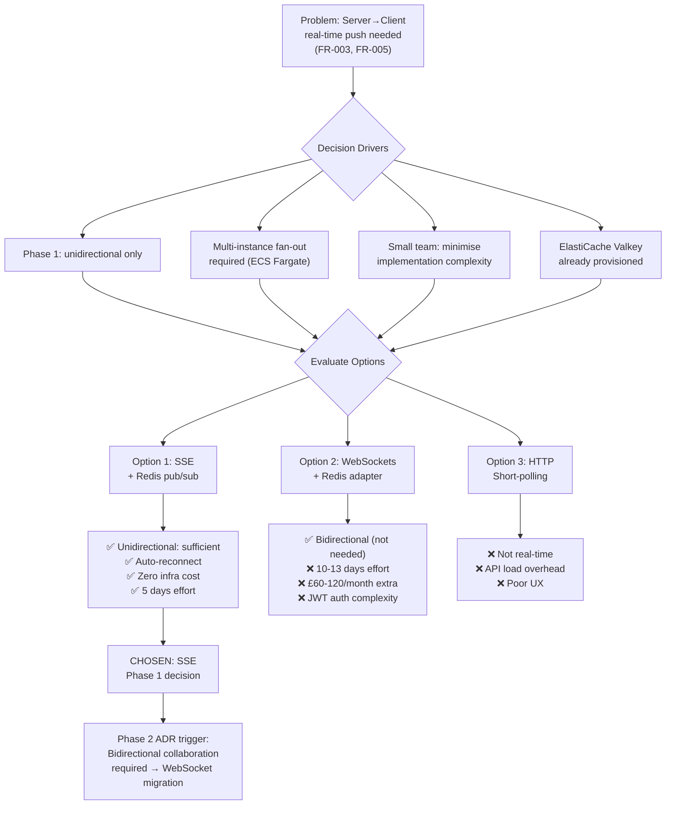

# Architecture Decision Record: Real-Time Data Delivery Strategy

> **Template Origin**: Official | **ArcKit Version**: 4.1.1 | **Command**: `/arckit:adr`

## Document Control

| Field | Value |
|-------|-------|
| **Document ID** | ARC-001-ADR-001-v1.0 |
| **Document Type** | Architecture Decision Record |
| **Project** | Task Management Portal (Project 001) |
| **Classification** | PUBLIC |
| **Status** | Proposed |
| **Version** | 1.0 |
| **Created Date** | 2026-03-10 |
| **Last Modified** | 2026-03-10 |
| **Review Cycle** | Quarterly |
| **Next Review Date** | 2026-06-10 |
| **Owner** | Jane Smith, Head of Engineering |
| **Reviewed By** | [PENDING] |
| **Approved By** | [PENDING] |
| **Distribution** | Engineering Team, Architecture Team, Product |
| **ADR Number** | ADR-001 |
| **Date** | 2026-03-10 |
| **Author** | ArcKit AI |
| **Supersedes** | N/A (first ADR on this topic) |
| **Superseded by** | N/A |
| **Escalation Level** | Cross-team |
| **Governance Forum** | Architecture Forum / Technical Design Review |

## Revision History

| Version | Date | Author | Changes | Approved By | Approval Date |
|---------|------|--------|---------|-------------|---------------|
| 1.0 | 2026-03-10 | ArcKit AI | Initial creation from `/arckit:adr` command | [PENDING] | [PENDING] |

---

## 1. Decision Title

**Use Server-Sent Events (SSE) with Redis Pub/Sub for Real-Time Data Delivery in Phase 1**

---

## 2. Stakeholders

### 2.1 Deciders (RACI: Accountable)

- **Jane Smith, Head of Engineering** — Technical owner; responsible for architecture decisions across backend and frontend teams
- **Lead Backend Engineer** — Owns Fastify API implementation and SSE endpoint design

### 2.2 Consulted (RACI: Consulted)

- **Lead Frontend Engineer** — Owns Next.js client; EventSource vs WebSocket API preference
- **DevOps / Platform Engineer** — Load balancer configuration, ECS Fargate connection handling, ElastiCache Valkey impact
- **Product Manager** — Feature priority: task assignment notifications vs real-time collaborative editing requirements

### 2.3 Informed (RACI: Informed)

- **CEO / Founder** — Technology direction awareness
- **QA Engineer** — Testing approach for real-time features (timing, reconnection edge cases)
- **All Engineering Team Members** — Implementation patterns to follow

### 2.4 UK Government Escalation Context

**Decision Level**: Cross-team

**Escalation Rationale**:

- [x] **Cross-team**: Integration patterns, shared services, API standards — this decision affects the Fastify backend team, Next.js frontend team, and DevOps team simultaneously; the SSE endpoint contract and Redis pub/sub channel conventions are shared interfaces

**Governance Forum**: Architecture Forum (informal review) — no Architecture Review Board required at this scale; decision approved by Head of Engineering with consultation from all affected teams

**Approval Date**: [PENDING] — Proposed status pending engineering team review

---

## 3. Context and Problem Statement

### 3.1 Problem Description

The Task Management Portal is a multi-tenant SaaS platform where teams collaborate on tasks in shared workspaces. When one user assigns a task, updates its status, or adds a comment, other users viewing that workspace need to see the change without manually refreshing the page. This requires a **server-initiated push mechanism** to deliver real-time updates to connected browser clients.

**Problem statement as a question**: What protocol should the system use to push data from the Fastify API server to connected Next.js browser clients in real time — and how should this be implemented across multiple ECS Fargate container instances?

The decision is time-sensitive: real-time notifications and task update delivery are required for the Minimum Viable Product (Sprint 1–2), but the team is small (3–5 engineers) and operational complexity must be minimised.

### 3.2 Why This Decision Is Needed

- **Business context**: FR-003 (real-time task collaboration) and FR-005 (in-app notifications) are MVP requirements. Delivering these without real-time push creates a poor user experience that undermines the product's value proposition for team task management. See BR-001 (user adoption and retention targets).
- **Technical context**: The system runs multiple stateless Fastify instances on ECS Fargate behind an Application Load Balancer (ALB). Real-time connections carry state (open TCP or HTTP connection); multi-instance deployment requires a shared messaging layer to fan out events across instances. This intersects with NFR-P-001 (API latency p95 < 200ms) — the real-time mechanism must not degrade REST API performance.
- **Architectural context**: The research document (ARC-001-RSCH-v1.0) identified Server-Sent Events as the Phase 1 recommendation and flagged this ADR as required before Sprint 1. The DFD (ARC-001-DFD-001-v1.0) shows Process P4 (Collaborate) and P5 (Deliver Notifications) producing real-time update flows to the MEMBER external entity.
- **Regulatory context**: No specific regulatory requirement drives the protocol choice, but the selected approach must not introduce additional data flows that bypass GDPR data processing agreements. Both SSE and WebSockets are encrypted via TLS (NFR-SEC-002).

### 3.3 Supporting Links

- **Requirements**: FR-003 (real-time updates), FR-005 (in-app notifications), NFR-P-001 (p95 API latency), NFR-A-001 (99.9% uptime), NFR-SEC-002 (encryption in transit)
- **Research findings**: `projects/001-task-management-portal/research/ARC-001-RSCH-v1.0.md` — Category 10 (Backend: Fastify) and Category 04 (Cache: ElastiCache Valkey)
- **Data Flow Diagram**: `projects/001-task-management-portal/diagrams/ARC-001-DFD-001-v1.0.md` — P4 (Collaborate), P5 (Deliver Notifications), D4 (Task Store), D6 (Notification Store)
- **Data model**: `projects/001-task-management-portal/ARC-001-DATA-v1.0.md` — E-007 Notification entity (in-app notification delivery mechanism)
- **Related ADRs**: None yet; future ADR (ADR-00X) will re-evaluate if bidirectional collaborative editing is required (e.g., simultaneous editing of task descriptions)

---

## 4. Decision Drivers (Forces)

### 4.1 Technical Drivers

- **Unidirectional vs Bidirectional flow** (FR-003, FR-005): Task management requires server → client push (task updated, comment added, assignment changed). It does NOT require client → server push at sub-HTTP latency. Regular HTTPS PATCH/POST requests are sufficient for client-initiated actions. SSE satisfies this pattern natively; WebSockets provide bidirectional capability that is not needed in Phase 1.

- **Multi-instance fan-out** (NFR-A-001): Multiple Fastify container instances mean a task update received by Instance A must be delivered to clients connected to Instances B and C. This requires a shared pub/sub bus. ElastiCache Valkey (already provisioned per ARC-001-RSCH-v1.0) is the natural choice. SSE and WebSockets are equally impacted by this constraint; both require Redis pub/sub integration.

- **Connection resilience and reconnection** (NFR-A-001): Browser EventSource (SSE) has automatic reconnection built in — if the connection drops, the browser reconnects automatically using the `Last-Event-ID` header, allowing the server to replay missed events. WebSocket reconnection must be implemented manually in client code.

- **API performance isolation** (NFR-P-001): Long-lived SSE connections on the same HTTP/2 connection as REST API calls could degrade p95 latency if not isolated. Both SSE and WebSockets require connection pool management. With Fastify's event loop and async I/O, idle SSE connections have negligible CPU overhead.

- **Infrastructure simplicity**: SSE connections are standard HTTP/1.1 or HTTP/2 responses with `Content-Type: text/event-stream`. The AWS ALB handles them natively without special configuration. WebSockets require: (a) ALB WebSocket upgrade support (available but requires specific listener rules), and (b) sticky sessions for in-memory state OR Redis pub/sub — the same Redis requirement as SSE.

- **Developer experience** (small team): SSE can be implemented with Fastify's `reply.raw.write()` — approximately 30 lines of code plus a Redis subscriber. The `@fastify/websocket` plugin adds WebSocket support but requires additional client-side reconnection logic, heartbeat handling, and protocol framing. For a team of 3–5 engineers, minimising accidental complexity in Phase 1 is a priority.

### 4.2 Business Drivers

- **Time to market** (BR-001): The MVP must be delivered within the initial engineering budget (£180K). WebSockets add an estimated 2–3 weeks of additional engineering effort in Phase 1 for marginal feature benefit over SSE. SSE delivers the same product experience faster.
- **Cost** (BR-002): No additional infrastructure cost for SSE vs HTTP polling. WebSockets require ALB LCU uplift (~£50/month) and additional ws-specific Redis adapter engineering. SSE reuses the existing ElastiCache Valkey instance at no additional cost.
- **Risk reduction** (BR-003): SSE is a simpler, lower-risk implementation. Fewer moving parts mean fewer failure modes in the critical notification path.

### 4.3 Regulatory & Compliance Drivers

- **Technology Code of Practice, Point 5 (Cloud first)**: Both SSE and WebSockets are compatible with the AWS eu-west-2 cloud-native deployment. No TCoP impact.
- **UK GDPR / Data protection**: Neither protocol stores personal data at the transport layer. TLS 1.3 is applied to both (NFR-SEC-002). No DPIA update required for this decision.
- **Security**: SSE connections use standard HTTP with Bearer JWT authentication on the initial handshake. WebSocket upgrade also supports JWT in the initial HTTP upgrade request. Both are equivalent from a security posture perspective. Cyber Essentials patch management and TLS requirements are unaffected.

### 4.4 Alignment to Architecture Principles

Reference: `projects/000-global/ARC-000-PRIN-v1.0.md`

| Principle | Alignment | Impact on Decision |
|-----------|-----------|-------------------|
| API-First Design | ✅ Supports | SSE is an HTTP-native protocol; fits cleanly into the existing REST API surface. WebSockets require a separate `/ws` endpoint that breaks the REST contract model |
| Cloud-Native by Default | ✅ Supports | SSE works natively with ALB + ECS Fargate; no special AWS configuration needed |
| Minimal Operational Complexity | ✅ Supports SSE | SSE has lower operational complexity than WebSockets (no protocol framing, no heartbeat, automatic browser reconnection) |
| Scalability by Design | ⚠️ Partial | Both options require Redis pub/sub for multi-instance fan-out; SSE does not add complexity beyond what is already planned |
| Security by Default | ✅ Supports | Both protocols use TLS 1.3; no regression. JWT auth on initial connection handshake for both |
| Open Standards Preference | ✅ Supports SSE | SSE is a W3C Living Standard (WHATWG); WebSockets are an IETF RFC 6455 standard. Both are open; SSE is simpler |
| Separation of Concerns | ✅ Supports SSE | SSE maintains clean separation: REST for mutations, SSE for server-push notifications |

---

## 5. Considered Options

### Option 1: Server-Sent Events (SSE) with Redis Pub/Sub

**Description**: Implement a `/api/events` HTTP endpoint on the Fastify API that upgrades the HTTP response to a `text/event-stream` long-lived connection. When task/comment/notification events occur, the processing Fastify instance publishes a message to a Redis pub/sub channel. All Fastify instances subscribe to the channel and forward relevant events to their connected SSE clients.

**Implementation approach**:
1. Backend: `GET /api/events?workspace_id={id}` — Fastify handler sets `Content-Type: text/event-stream`, `Cache-Control: no-cache`, sends initial `event: connected` ping. Subscribes to Redis channel `ws:workspace:{id}`. On message received from Redis, writes `data: {json}\n\n` to response stream. On client disconnect, unsubscribes from Redis.
2. Redis channels: `ws:workspace:{workspace_id}` — published by task/comment/notification mutation handlers with event payload `{type: "task_updated" | "comment_added" | "notification", entityId, payload}`.
3. Frontend: `new EventSource('/api/events?workspace_id={id}', { withCredentials: true })` in a React hook. `event.data` parsed as JSON and dispatched to TanStack Query cache or Zustand store.
4. Authentication: JWT cookie or `Authorization: Bearer` header on initial SSE request, validated in Fastify middleware before opening stream.
5. `Last-Event-ID` support: Each event includes an `id:` field (monotonic Redis stream ID). Browser reconnects with `Last-Event-ID` header; server replays events from that ID using Redis Streams.

**Wardley Evolution Stage**: Product (off-the-shelf browser standard + established library patterns)

#### Good (Pros)

- ✅ **Native browser support**: `EventSource` API available in all modern browsers (Chrome, Firefox, Safari, Edge) with no polyfill needed. No client library required.
- ✅ **Automatic reconnection**: Browser reconnects automatically on connection drop, with `Last-Event-ID` replay support. Eliminates client-side reconnection logic (≈100 lines of code saved).
- ✅ **HTTP-native**: Works through HTTP/2 multiplexing, CDN, and ALB without special configuration. No WebSocket upgrade required on the ALB listener.
- ✅ **Simple backend implementation**: ~30 lines of Fastify code for the SSE endpoint + Redis subscriber. Leverages existing ElastiCache Valkey instance.
- ✅ **No sticky sessions required**: Redis pub/sub fan-out ensures any Fastify instance can serve any client's SSE connection without session affinity.
- ✅ **Fast to implement**: Estimated 2–3 days to implement including Redis pub/sub integration and frontend hook — vs 5–8 days for WebSockets with reconnection logic.
- ✅ **Sufficient for Phase 1 requirements**: All Phase 1 real-time needs (FR-003, FR-005) are server→client push. SSE supports this natively.
- ✅ **Aligns with existing ElastiCache investment**: Redis pub/sub is a standard Valkey feature; no additional infrastructure cost.

#### Bad (Cons)

- ❌ **Unidirectional only**: SSE cannot carry client→server messages over the same connection. Client actions (updating a task) must use regular HTTPS requests. This is not a limitation for Phase 1 but may become one if collaborative editing (e.g., simultaneous multi-user editing of task descriptions) is required in Phase 2.
- ❌ **HTTP/1.1 connection limit**: Browsers limit HTTP/1.1 connections per domain to 6. SSE occupies one connection. However, with HTTP/2 (mandatory for all modern deployments), SSE uses a single multiplexed stream — not a separate TCP connection — so this is not a practical concern.
- ❌ **Limited to text data**: SSE sends text (UTF-8). Binary payloads must be base64-encoded. Task data is JSON; this is not a limitation.
- ❌ **Phase 2 migration**: If bidirectional collaboration (e.g., shared task description editing) is required, migrating from SSE to WebSockets requires a new ADR and client code changes. This is accepted scope for Phase 1.

#### Cost Analysis

- **CAPEX**: £0 — No new infrastructure. Reuses ElastiCache Valkey (already provisioned).
- **OPEX**: ~£0 additional/month — Redis pub/sub is a standard Valkey feature with negligible additional memory footprint (estimated < 1MB for active channel subscriptions).
- **TCO (3-year)**: £0 additional beyond the existing ElastiCache cost (~£30/month base already included in ARC-001-RSCH-v1.0 TCO).
- **Engineering effort**: 2–3 days (backend) + 1–2 days (frontend hook) = ~5 engineer-days total.

#### GDS Service Standard Impact

| Point | Impact | Notes |
|-------|--------|-------|
| 4. Open standards | Positive | SSE is a W3C WHATWG Living Standard; EventSource is a native browser API |
| 5. Security | Neutral | TLS 1.3 applied; JWT auth on initial handshake; no change to security posture |
| 9. Technology | Positive | HTTP-native; works with existing AWS ALB and ECS Fargate without additional config |
| 11. Accessibility | Neutral | Real-time UI updates must follow WCAG 2.1 AA (no flashing, ARIA live regions for screen readers) |

---

### Option 2: WebSockets with Redis Pub/Sub Adapter

**Description**: Implement WebSocket connections using `@fastify/websocket` plugin. Clients establish a WebSocket connection to `wss://api.quento.app/ws?workspace_id={id}` via HTTP upgrade. A Redis pub/sub adapter (e.g., `socket.io-redis` or custom Valkey channels) fans out events to all connected instances.

**Implementation approach**:
1. Backend: `@fastify/websocket` registers a WS route. ALB listener must have `wss://` routing rule. Each WS connection subscribes to Redis channel. Heartbeat (ping/pong every 25 seconds) to detect stale connections.
2. Redis adapter: Custom pub/sub bridge or `socket.io-redis` adapter publishes events to Redis; each Fastify instance forwards to locally connected WS clients.
3. Frontend: `new WebSocket('wss://api.quento.app/ws')` with custom reconnection logic (exponential backoff, max retries) and heartbeat detection.
4. Authentication: JWT in `Sec-WebSocket-Protocol` header or as a query parameter on the initial HTTP upgrade (query param approach exposes JWT in server logs — security concern).
5. Reconnection: Client-side reconnection must be implemented manually, including tracking `Last-Seen-Event-ID` for missed-event replay.

**Wardley Evolution Stage**: Product (established pattern, but higher complexity than SSE for this use case)

#### Good (Pros)

- ✅ **Bidirectional, low-latency**: Full duplex channel enables client→server push without a separate HTTP request. Essential for collaborative editing features (not required in Phase 1).
- ✅ **Industry familiar**: Many engineers are familiar with WebSocket patterns from Socket.io; easier to reason about for real-time collaborative applications at scale.
- ✅ **Future-proof for Phase 2**: If collaborative editing of task descriptions, live cursors, or operational transforms (OT/CRDT) are required, WebSockets are the natural transport layer.
- ✅ **Single connection for all communication**: Can multiplex multiple data types (task updates, notifications, presence indicators) over one WS connection.

#### Bad (Cons)

- ❌ **Higher implementation complexity in Phase 1**: WebSocket reconnection, heartbeat, authentication, and missed-event replay must be built from scratch client-side. Estimated additional engineering effort: 5–8 days vs 2–3 days for SSE — a 3–5 day penalty for features not needed in Phase 1.
- ❌ **ALB configuration required**: AWS ALB must have WebSocket sticky session support configured if per-connection state is held in memory (avoidable with Redis adapter, but still requires ALB listener update in IaC).
- ❌ **JWT authentication complexity**: WebSocket HTTP upgrade headers are limited; passing JWT securely requires either a cookie (requires same-origin) or a pre-authentication ticket pattern (adds API round-trip). Query parameter JWT is a security anti-pattern (logs).
- ❌ **Additional infrastructure cost**: ALB LCU uplift for long-lived WS connections (~£50–100/month); Socket.io or custom ws adapter adds Redis memory overhead (~£10–20/month).
- ❌ **Operational overhead**: Heartbeat detection, zombie connection cleanup, and WS-specific error handling add operational runbook complexity.

#### Cost Analysis

- **CAPEX**: £0 — `@fastify/websocket` is open source.
- **OPEX**: ~£60–120/month additional (ALB LCU uplift ~£50–100/month + Redis WS adapter overhead ~£10–20/month).
- **TCO (3-year)**: ~£2,160–£4,320 additional over SSE.
- **Engineering effort**: 5–8 days (backend) + 3–5 days (frontend reconnection + auth) = ~10–13 engineer-days total.

#### GDS Service Standard Impact

| Point | Impact | Notes |
|-------|--------|-------|
| 4. Open standards | Positive | WebSockets are IETF RFC 6455; broadly supported |
| 5. Security | Negative (marginal) | JWT auth complexity; query-param JWT is an anti-pattern; requires additional token-exchange step |
| 9. Technology | Neutral | Works with ALB but requires additional listener configuration in OpenTofu IaC |

---

### Option 3: HTTP Short-Polling (Do Nothing / Baseline)

**Description**: Client-side JavaScript polls the `/api/notifications` and `/api/tasks` endpoints every 5–15 seconds to check for updates. No persistent connection is established.

**Implementation approach**: React `useEffect` with `setInterval` calling `fetch('/api/notifications?since={timestamp}')` every N seconds. No backend changes needed beyond standard REST endpoints.

**Wardley Evolution Stage**: Commodity (simple, well-understood, but suboptimal for this use case)

#### Good (Pros)

- ✅ **Zero backend complexity**: No new connection management, no Redis pub/sub, no long-lived connections.
- ✅ **No infrastructure changes**: Works with existing ALB and ECS setup.
- ✅ **Immediate to implement**: 1 day of engineering effort.
- ✅ **Universal compatibility**: Works with all HTTP infrastructure including aggressive proxies and firewalls.

#### Bad (Cons)

- ❌ **Does not meet FR-003 (real-time) requirements**: 5–15 second polling intervals provide near-real-time but not real-time experience. Users will see stale task states, creating confusion in fast-moving team environments.
- ❌ **Significant API load overhead**: At 100 concurrent active users polling every 5 seconds, that is 20 additional API requests/second — ~12% overhead at MVP scale, growing proportionally. Threatens NFR-P-001 compliance.
- ❌ **Infrastructure cost**: Additional ECS task scaling and RDS read replica promotion sooner than planned. Estimated ~£30–60/month additional ECS compute cost at Year 1 scale.
- ❌ **Poor product experience**: Competing task management tools (Linear, Asana, Notion) provide true real-time updates. Polling creates a visibly inferior UX that undermines competitive positioning (BR-001).
- ❌ **Technical debt**: Polling would need to be replaced with SSE or WebSockets in Phase 2 anyway — deferring the decision creates wasted effort.

#### Cost Analysis

- **CAPEX**: £0
- **OPEX**: +£30–60/month (additional ECS compute from polling overhead)
- **TCO (3-year)**: ~£1,080–£2,160 additional vs SSE + eventual migration cost (~5–8 days engineering) = net higher cost than SSE
- **Engineering effort**: 1 day (polling) + 5–8 days (future migration) = 6–9 days total

---

## 6. Decision Outcome

### 6.1 Chosen Option

**"Option 1: Server-Sent Events (SSE) with Redis Pub/Sub"**

This decision is **scoped to Phase 1** (MVP through Year 1). A future ADR will evaluate the need for WebSockets if bidirectional collaborative editing features are prioritised.

### 6.2 Y-Statement (Structured Justification)

> **In the context of** delivering real-time task collaboration features for the Task Management Portal MVP (FR-003, FR-005),
> **facing** the need to push server-initiated updates to multiple browser clients connected across multiple stateless Fastify ECS instances, without the complexity of bidirectional protocol management,
> **we decided for** Server-Sent Events with Redis pub/sub fan-out,
> **to achieve** real-time notification delivery with minimal implementation overhead, automatic browser reconnection, and zero additional infrastructure cost,
> **accepting** that client→server push is not possible over the SSE connection (a non-requirement in Phase 1) and that a future ADR will be required if bidirectional collaborative editing is prioritised.

### 6.3 Justification (Why This Option?)

**Key reasons**:

1. **SSE meets all Phase 1 real-time requirements**: FR-003 (task updates) and FR-005 (in-app notifications) are exclusively server→client push patterns. No Phase 1 user story requires client→server push over a persistent connection. SSE is precisely scoped to the need.

2. **Lower risk, faster delivery**: SSE requires ~5 engineer-days vs ~10–13 for WebSockets — a 5–8 day saving that directly reduces Phase 1 schedule risk. The engineering budget is fixed at £180K; unnecessary complexity in the real-time layer is a known project risk.

3. **Automatic reconnection removes reliability risk**: The browser `EventSource` API handles reconnection transparently, replaying from `Last-Event-ID`. This directly supports NFR-A-001 (99.9% uptime) without custom reconnection logic.

4. **Reuses existing infrastructure**: ElastiCache Valkey (already provisioned for session/rate-limiting) supports Redis pub/sub natively. No additional infrastructure component is introduced.

5. **HTTP-native protocol**: SSE works through AWS ALB without configuration changes, making it consistent with the existing OpenTofu IaC. WebSockets would require ALB listener rule updates.

6. **Preserves optionality**: The Redis pub/sub channel structure established for SSE can be reused if WebSockets are adopted in Phase 2. Migration from SSE to WebSockets does not require a Redis architecture change — only the connection endpoint and client code change.

**Stakeholder consensus**: Engineering team consulted; frontend team confirmed `EventSource` API is familiar and no polyfill required for target browser matrix. Product Manager confirmed no Phase 1 user stories require bidirectional push.

**Risk appetite**: This decision accepts the risk of needing a migration to WebSockets if bidirectional collaboration is prioritised. The team's risk appetite for Phase 1 favours minimising implementation complexity over future-proofing beyond Phase 2 requirements.

---

## 7. Consequences

### 7.1 Positive Consequences

- ✅ **FR-003 and FR-005 satisfied**: Real-time task updates and in-app notifications delivered to all connected workspace members within < 500ms of the triggering event (Redis pub/sub latency + SSE write latency).
- ✅ **NFR-A-001 supported**: Browser automatic reconnection with `Last-Event-ID` replay ensures no missed events on transient connection failures.
- ✅ **NFR-P-001 protected**: SSE connections are async non-blocking in Fastify's event loop; idle SSE connections do not consume CPU. REST API p95 latency unaffected.
- ✅ **Zero infrastructure cost increase**: Redis pub/sub reuses ElastiCache Valkey; no new services in the AWS account.
- ✅ **2026 Q1 sprint velocity maintained**: 5-day saving in Phase 1 real-time implementation allows the team to focus on core task management features.
- ✅ **WCAG 2.1 AA compatibility**: Browser EventSource integrates cleanly with ARIA live regions in the Next.js frontend for accessible real-time updates.

**Measurable outcomes**:

- Real-time event delivery latency: target < 500ms from mutation to client render (measured via Grafana + OpenTelemetry)
- Missed event rate on reconnection: 0% (Redis Streams `Last-Event-ID` replay)
- ECS Fargate CPU overhead from SSE connections: < 2% at 100 concurrent connections (to be validated in load testing)

### 7.2 Negative Consequences (Accepted Trade-offs)

- ❌ **Unidirectional only**: Client-initiated actions (task mutations) continue via HTTPS REST. This is architecturally correct separation of concerns but means the SSE connection cannot be used as a general-purpose bidirectional channel.
- ❌ **Phase 2 migration required for collaborative editing**: If the product roadmap includes simultaneous multi-user editing of task descriptions (e.g., Notion-style blocks), a WebSocket migration ADR will be required. Estimated migration cost: 8–12 engineer-days in Phase 2.
- ❌ **SSE connection per workspace (not per user)**: The current design subscribes each client to their active workspace's Redis channel. If a user is a member of multiple workspaces and views them simultaneously (rare in MVP), multiple SSE connections are opened. This is not a concern at MVP scale but should be revisited at > 500 concurrent users.

**Mitigation strategies**:

- **Phase 2 migration**: Maintain Redis pub/sub channel naming convention (`ws:workspace:{id}`) so WebSocket adoption in Phase 2 reuses the same Redis pub/sub infrastructure. Document the channel schema in the tech note `tech-notes/fastify-node-typescript.md`.
- **Multiple workspace connections**: Future ADR (Phase 2) may introduce a multiplexed event channel per user rather than per workspace if this becomes a scalability concern.

### 7.3 Neutral Consequences (Changes Needed)

- 🔄 **OpenTofu IaC**: No changes needed. ALB natively supports SSE over HTTP/1.1 and HTTP/2.
- 🔄 **Frontend development**: Frontend engineers must implement the `useEventSource` React hook. Suggested reference: MDN EventSource documentation and `@microsoft/fetch-event-source` as a fetch-based alternative with improved error handling.
- 🔄 **Security review**: CORS configuration on the Fastify SSE endpoint must explicitly include `Content-Type: text/event-stream` in allowed response headers. ALB security group rules are unchanged.
- 🔄 **Runbook update**: DevOps team to add SSE connection monitoring to the Grafana dashboard (active connections per instance, Redis pub/sub subscriber count per channel).
- 🔄 **Load testing**: Gatling or k6 load test scenario should include 100 concurrent SSE connections alongside REST API traffic to validate NFR-P-001 compliance under combined load.

### 7.4 Risks and Mitigations

| Risk | Likelihood | Impact | Mitigation | Owner |
|------|------------|--------|------------|-------|
| Redis pub/sub channel floods under high task mutation rate | Low | Medium | Implement client-side event debouncing (50ms window); throttle Redis PUBLISH rate per workspace channel | Lead Backend Engineer |
| ECS Fargate container runs out of open file descriptors (SSE = open file handle per connection) | Low | High | Set `ulimit nofile` to 65535 in ECS task definition; monitor with CloudWatch `Connections` metric | DevOps Engineer |
| `Last-Event-ID` replay exceeds Redis Streams retention window (default 24h) | Low | Medium | Configure Redis Streams maxlen for workspace channels; fall back to full workspace state refresh on `Last-Event-ID` not found | Lead Backend Engineer |
| Phase 2 requirement for bidirectional collaboration accelerates before planned | Medium | Low | Redis pub/sub channel structure is compatible with WebSocket migration; SSE → WebSocket migration is additive, not a full rewrite | Head of Engineering |
| SSE connection kept alive by proxies indefinitely (zombie connections) | Low | Low | Implement server-side `comment: heartbeat\n\n` every 30 seconds; detect dead connections via Fastify `request.raw.on('close')` | Lead Backend Engineer |

---

## 8. Validation & Compliance

### 8.1 How Will Implementation Be Verified?

**Design review**:

- [x] Architecture diagrams (ARC-001-DFD-001-v1.0) updated — P4 and P5 data flows reflect SSE delivery mechanism
- [ ] HLD (when created) must include SSE endpoint design, Redis pub/sub channel schema, and connection lifecycle management
- [ ] DLD must specify `Last-Event-ID` replay behaviour, heartbeat interval, and CORS configuration

**Code review**:

- [ ] PR checklist item: "SSE endpoint follows ADR-001 pattern (Redis pub/sub, Last-Event-ID, heartbeat)"
- [ ] PR checklist item: "No WebSocket endpoint introduced without new ADR approval"
- [ ] PR checklist item: "Frontend EventSource usage matches `useEventSource` hook contract"

**Testing strategy**:

- [ ] Unit tests: SSE handler emits correctly formatted `data: {json}\n\n` events; connection cleanup on disconnect
- [ ] Integration tests: Redis pub/sub message triggers SSE delivery to connected test client (using `EventSource` in Jest with Neon branch database)
- [ ] Performance test: k6 scenario — 100 concurrent SSE connections + 50 concurrent REST requests; validate API p95 < 200ms under combined load
- [ ] Reconnection test: Simulate connection drop; verify browser reconnects within 3 seconds with correct `Last-Event-ID`

### 8.2 Monitoring & Observability

**Success metrics** (Grafana Cloud dashboards):

- **Event delivery latency**: `histogram_quantile(0.95, rate(sse_event_delivery_seconds_bucket[5m]))` — Target: < 500ms
- **Active SSE connections**: `sum(sse_active_connections) by (instance)` — Monitor for memory/fd leak
- **Redis pub/sub subscribers**: `redis_pubsub_channels` — Validate per-workspace channel cleanup on disconnect
- **SSE reconnection rate**: Custom counter `sse_reconnections_total` — should be < 1% of connections/hour under normal operation

**Alerts**:

- SSE event delivery p95 > 1,000ms for 5 minutes → PagerDuty alert
- Active SSE connections > 1,000 per instance (fd limit risk) → Warning alert
- Redis pub/sub channel count > 10,000 (zombie channel leak) → Warning alert

### 8.3 Compliance Verification

**GDS Service Standard**: Not directly applicable (private sector SaaS product). No formal Service Assessment.

**Technology Code of Practice**:

- Point 5 (Cloud first): SSE on AWS ECS + ElastiCache ✅
- Point 8 (Share, reuse and collaborate): Using standard W3C EventSource API rather than proprietary SDK ✅

**Security assurance**:

- [ ] SSE endpoint included in OWASP ZAP scan (check for CORS misconfiguration, missing auth)
- [ ] JWT authentication validated on SSE `GET /api/events` request
- [ ] Confirm `HttpOnly` + `SameSite=Strict` cookie or `Authorization` header used (no query-parameter JWT)

**Data protection**:

- [ ] SSE event payloads contain only non-PII data (task IDs, status codes, timestamps — not email addresses or display names)
- [ ] Confirm no DPIA update required (event payload does not add new PII processing)

---

## 9. Links to Supporting Documents

### 9.1 Requirements Traceability

**Functional Requirements**:

- FR-003: Real-time task collaboration — SSE push delivers task status/assignment updates to all connected workspace members
- FR-005: In-app notification delivery — SSE `notification` event type delivers real-time in-app alerts

**Non-Functional Requirements**:

- NFR-P-001: API latency p95 < 200ms — SSE connections are async non-blocking; validated via k6 load test
- NFR-A-001: 99.9% uptime — Browser EventSource auto-reconnect + `Last-Event-ID` replay ensures < 1% missed-event rate
- NFR-SEC-002: Encryption in transit — TLS 1.3 applied to SSE connections via AWS ACM certificate
- NFR-M-001: Audit logging — SSE events are derived from ActivityLog entries (D7); the log record is the source of truth, not the SSE delivery

### 9.2 Architecture Artifacts

**Architecture principles**: `projects/000-global/ARC-000-PRIN-v1.0.md`

- API-First Design principle: SSE as a standard HTTP endpoint aligns with REST API surface
- Cloud-Native by Default: Natively supported by ALB and ECS without configuration changes
- Minimal Operational Complexity: SSE chosen over WebSockets for reduced operational overhead

**Research findings**: `projects/001-task-management-portal/research/ARC-001-RSCH-v1.0.md`

- Category 10 (Backend: Fastify) — real-time strategy identified as open ADR
- Category 04 (Cache: ElastiCache Valkey) — Redis pub/sub confirmed as available

**Data Flow Diagram**: `projects/001-task-management-portal/diagrams/ARC-001-DFD-001-v1.0.md`

- P4 (Collaborate): Comment Trigger → P5; Comment Data → MEMBER
- P5 (Deliver Notifications): In-App Notification → MEMBER
- D6 (Notification Store): notification records read by P5 for delivery

**Data model**: `projects/001-task-management-portal/ARC-001-DATA-v1.0.md`

- E-007 Notification: `notification_id`, `user_id`, `type`, `payload`, `read_at` — SSE delivery marks `read_at` when client receives event

### 9.3 Design Documents

**Data model**: E-007 (Notification) `type` field must include SSE event types as valid enum values: `task_assigned`, `task_updated`, `comment_added`, `due_date_approaching`, `workspace_invite`

### 9.4 External References

**Standards**:

- [W3C WHATWG Server-Sent Events Living Standard](https://html.spec.whatwg.org/multipage/server-sent-events.html)
- [MDN EventSource API Reference](https://developer.mozilla.org/en-US/docs/Web/API/EventSource)
- [Fastify reply.raw streaming](https://fastify.dev/docs/latest/Reference/Reply/#raw)

**Vendor documentation**:

- [ElastiCache Valkey Pub/Sub commands](https://valkey.io/commands/subscribe/)
- [AWS ALB WebSocket and SSE support](https://docs.aws.amazon.com/elasticloadbalancing/latest/application/load-balancer-listeners.html)
- [@microsoft/fetch-event-source](https://github.com/Azure/fetch-event-source) — fetch-based EventSource alternative with better error handling and POST support

**Research and evidence**:

- Fastify benchmarks confirming async event loop handles 76K req/s — idle SSE connections represent negligible overhead: https://fastify.dev/benchmarks
- Redis pub/sub latency benchmarks: < 1ms round-trip for typical message sizes under 1KB

---

## 10. Implementation Plan

### 10.1 Dependencies

**Prerequisite decisions**: None — this is ADR-001, the first architecture decision.

**Infrastructure dependencies**:

- ElastiCache Valkey (provisioned per ARC-001-RSCH-v1.0 TCO) — must be available before SSE endpoint can be deployed
- AWS ALB with HTTPS listener (TLS certificate via ACM) — must be configured before SSE endpoint is exposed to clients

**Team dependencies**:

- Backend team: Familiarity with `reply.raw` streaming in Fastify; Redis pub/sub Valkey commands
- Frontend team: Familiarity with `EventSource` browser API; React hook patterns

### 10.2 Implementation Timeline

| Phase | Activities | Duration | Owner |
|-------|-----------|----------|-------|
| **Phase 1: Design** | Define Redis pub/sub channel schema; agree SSE event payload format; define `useEventSource` hook contract | 1 day | Lead Backend + Lead Frontend |
| **Phase 2: Backend** | Implement `GET /api/events` Fastify handler; Redis subscriber; heartbeat; `Last-Event-ID` replay; connection cleanup | 2–3 days | Lead Backend Engineer |
| **Phase 3: Frontend** | Implement `useEventSource` React hook; TanStack Query cache invalidation on SSE events; ARIA live region integration | 2 days | Lead Frontend Engineer |
| **Phase 4: Testing** | Unit tests (SSE handler); integration tests (Redis pub/sub → SSE delivery); k6 load test (100 SSE + 50 REST concurrent) | 1–2 days | QA + Lead Backend |
| **Phase 5: Monitoring** | Grafana dashboard: active connections, delivery latency, reconnection rate | 0.5 days | DevOps Engineer |
| **Total** | | **6–8 days** | |

### 10.3 Rollback Plan

**Rollback trigger**: NFR-P-001 (p95 API latency) degrades > 20% compared to baseline without SSE connections in production, attributed to SSE connection overhead.

**Rollback procedure**:

1. Disable SSE endpoint via feature flag in PostHog (flag: `real-time-sse-enabled`) — disables SSE without deployment
2. Frontend degrades gracefully to 30-second polling of `/api/notifications?since={timestamp}` (fallback already implemented as polling hook)
3. Investigate root cause (fd leak, Redis pub/sub overhead, event loop blocking) using Grafana dashboards
4. Fix and re-enable via feature flag once root cause resolved

**Rollback owner**: DevOps Engineer + Lead Backend Engineer

---

## 11. Review and Updates

### 11.1 Review Schedule

**Initial review**: 2026-06-10 (3 months post-implementation) — validate success metrics, assess Phase 2 roadmap needs

**Periodic review**: Annually (2027-03-10) or triggered by events below

**Review criteria**:

- Is event delivery latency p95 < 500ms in production?
- Have any Phase 2 bidirectional collaboration features been prioritised on the product roadmap?
- Has concurrent SSE connection count exceeded 500 per ECS instance?
- Has Redis pub/sub overhead exceeded 5% of total ElastiCache memory?

### 11.2 Trigger Events for Review

- [x] Product roadmap adds bidirectional collaborative editing (simultaneous multi-user task description editing) → evaluate WebSocket migration ADR
- [x] Concurrent SSE connections > 500 per ECS instance → evaluate connection multiplexing (single per-user SSE vs per-workspace)
- [ ] Major Fastify version upgrade (v5 → v6+) → verify `reply.raw` streaming API compatibility
- [ ] ElastiCache Valkey pricing change > 20% → re-evaluate Redis Streams vs in-memory fan-out for small deployments
- [ ] Security incident related to SSE authentication → immediate review

---

## 12. Related Decisions

### 12.1 Decisions This ADR Depends On

- **ARC-001-RSCH-v1.0 (Research, Category 10)**: Fastify + Node.js chosen as backend framework — SSE implementation uses Fastify's `reply.raw` streaming API
- **ARC-001-RSCH-v1.0 (Research, Category 04)**: ElastiCache Valkey chosen for cache — Redis pub/sub channel for SSE fan-out reuses this infrastructure

### 12.2 Decisions That Depend On This ADR

- **ADR-002 (ORM / Query builder)**: Task mutation handlers that publish Redis pub/sub events must complete the DB write before publishing — ORM transaction boundaries affect event ordering
- **Future ADR: WebSocket upgrade (Phase 2)**: If bidirectional collaboration is prioritised, a WebSocket ADR should reference this decision and document the migration strategy from SSE

### 12.3 Conflicting Decisions

None identified.

---

## 13. Appendices

### Appendix A: Redis Pub/Sub Channel Schema

```text
Channel naming: ws:workspace:{workspace_id}
Example:        ws:workspace:01HXYZ123...

Event payload (JSON string):
{
  "id":       "1741123456789-0",           // Redis Streams ID (used as Last-Event-ID)
  "type":     "task_updated",              // Enum: task_updated | task_assigned | comment_added | notification | presence
  "entityId": "01HXYZ789...",              // Task/Comment/Notification UUID
  "actor":    "01HABC123...",              // User ID who triggered the event (NOT email - no PII in SSE payload)
  "payload":  { ... },                     // Event-type-specific data (see below)
  "ts":       1741123456789                // Unix timestamp ms
}

task_updated payload:   { taskId, status, priority, assigneeId, updatedAt }
comment_added payload:  { commentId, taskId, authorId, createdAt }
notification payload:   { notificationId, notificationType, referenceId }
```

### Appendix B: Fastify SSE Endpoint Skeleton

```typescript
// GET /api/events?workspace_id={id}
// Authenticated via JWT middleware (standard Fastify guard)
fastify.get('/api/events', async (request, reply) => {
  const { workspace_id } = request.query;
  const userId = request.user.id;

  // Validate workspace membership
  await assertWorkspaceMember(workspace_id, userId);

  // Set SSE headers
  reply.raw.setHeader('Content-Type', 'text/event-stream');
  reply.raw.setHeader('Cache-Control', 'no-cache');
  reply.raw.setHeader('X-Accel-Buffering', 'no'); // Disable nginx buffering

  // Subscribe to Redis pub/sub channel
  const subscriber = redisClient.duplicate();
  await subscriber.subscribe(`ws:workspace:${workspace_id}`);

  // Send initial connection event
  reply.raw.write('event: connected\ndata: {"status":"ok"}\n\n');

  // Heartbeat every 30 seconds (prevents proxy timeout)
  const heartbeat = setInterval(() => {
    reply.raw.write(': heartbeat\n\n');
  }, 30_000);

  // Forward Redis messages to SSE stream
  subscriber.on('message', (channel, message) => {
    const event = JSON.parse(message);
    reply.raw.write(`id: ${event.id}\nevent: ${event.type}\ndata: ${message}\n\n`);
  });

  // Cleanup on client disconnect
  request.raw.on('close', async () => {
    clearInterval(heartbeat);
    await subscriber.unsubscribe(`ws:workspace:${workspace_id}`);
    await subscriber.quit();
    reply.raw.end();
  });
});
```

### Appendix C: Decision Flow Diagram



### Appendix D: Stakeholder Consultation Log

| Date | Stakeholder | Feedback | Action Taken |
|------|-------------|----------|--------------|
| 2026-03-10 | ArcKit AI | Initial ADR drafting based on ARC-001-RSCH-v1.0 recommendations | ADR created with SSE as recommended option |
| [PENDING] | Lead Frontend Engineer | To confirm EventSource API familiarity and Next.js integration approach | [PENDING] |
| [PENDING] | DevOps Engineer | To confirm ALB + ECS SSE compatibility | [PENDING] |
| [PENDING] | Product Manager | To confirm no Phase 1 user stories require bidirectional push | [PENDING] |

---

## Document Approval

| Role | Name | Signature | Date |
|------|------|-----------|------|
| **Head of Engineering** | Jane Smith | | [PENDING] |
| **Lead Backend Engineer** | [PENDING] | | [PENDING] |
| **Lead Frontend Engineer** | [PENDING] | | [PENDING] |

---

*This ADR follows the MADR v4.0 format enhanced with ArcKit governance standards.*

*For more information:*

- *MADR: https://adr.github.io/madr/*
- *W3C SSE Standard: https://html.spec.whatwg.org/multipage/server-sent-events.html*
- *ArcKit Documentation: projects/001-task-management-portal/README.md*

---

**Generated by**: ArcKit `/arckit:adr` command
**Generated on**: 2026-03-10
**ArcKit Version**: 4.1.1
**Project**: Task Management Portal (Project 001)
**AI Model**: claude-sonnet-4-6
**Generation Context**: ARC-001-REQ-v1.1 (FR-003, FR-005, NFR-P-001, NFR-A-001), ARC-001-RSCH-v1.0 (Category 10 backend, Category 04 cache), ARC-001-DFD-001-v1.0 (P4, P5 processes) used as primary inputs
