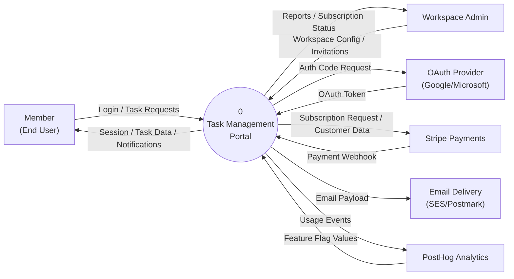
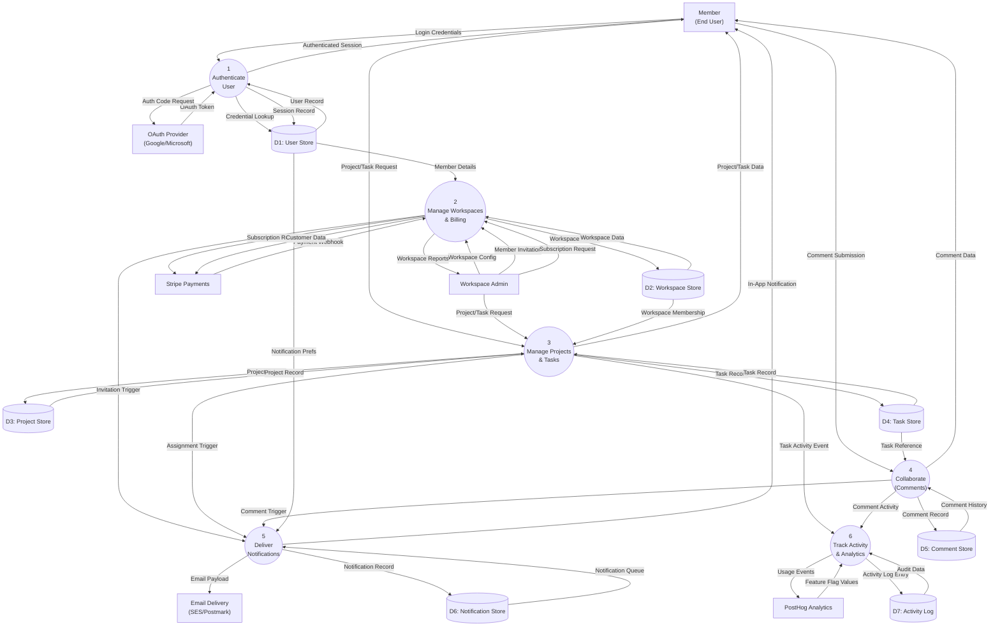

# Data Flow Diagram: Task Management Portal

> **Template Origin**: Official | **ArcKit Version**: 4.1.1 | **Command**: `/arckit:dfd`

## Document Control

| Field | Value |
|-------|-------|
| **Document ID** | ARC-001-DFD-001-v1.0 |
| **Document Type** | Data Flow Diagram |
| **Project** | Task Management Portal (Project 001) |
| **Classification** | PUBLIC |
| **Status** | DRAFT |
| **Version** | 1.0 |
| **Created Date** | 2026-03-10 |
| **Last Modified** | 2026-03-10 |
| **Review Cycle** | Monthly |
| **Next Review Date** | 2026-04-10 |
| **Owner** | Jane Smith, Head of Engineering |
| **Reviewed By** | [PENDING] |
| **Approved By** | [PENDING] |
| **Distribution** | Engineering, Product, Architecture Teams |
| **DFD Level** | All Levels (Context + Level 1) |
| **Notation** | Yourdon-DeMarco |

## Revision History

| Version | Date | Author | Changes | Approved By | Approval Date |
|---------|------|--------|---------|-------------|---------------|
| 1.0 | 2026-03-10 | ArcKit AI | Initial creation from `/arckit:dfd` command | [PENDING] | [PENDING] |

---

## Yourdon-DeMarco Notation Key

| Symbol | Shape | Description |
|--------|-------|-------------|
| **External Entity** | Rectangle | Source or sink of data outside the system boundary |
| **Process** | Circle (bubble) | Transforms incoming data flows into outgoing data flows |
| **Data Store** | Open-ended rectangle (parallel lines) | Repository of data at rest |
| **Data Flow** | Named arrow | Data in motion between components |

---

## System Boundary and Trust Zones

| Zone | Components | Description |
|------|-----------|-------------|
| **External (Untrusted)** | MEMBER, ADMIN, OAUTH, STRIPE, POSTHOG | Data crossing the system boundary must be validated and authenticated |
| **External (Trusted Service)** | EMAIL | Outbound-only; no inbound data flows accepted |
| **Internal (System Boundary)** | P1–P6, D1–D7 | All processes and data stores reside within the AWS eu-west-2 VPC; inter-process flows do not cross trust boundaries |

All inbound data flows from external entities are subject to:
- JWT authentication (authenticated endpoints)
- HMAC signature verification (STRIPE payment webhooks — `Stripe-Signature` header)
- OAuth code exchange (OAUTH flows — PKCE enforced)
- Input validation at API gateway before reaching any process

---

## Context Diagram (Level 0)

The context diagram shows the Task Management Portal as a single process (P0) with all six external entities that exchange data across the system boundary.

### `data-flow-diagram` Format

Render with: `pip install data-flow-diagram` then `dfd < file.dfd` (produces SVG/PNG with true Yourdon-DeMarco notation)

```dfd
title Context Diagram (Level 0) - Task Management Portal

entity    MEMBER   "Member\n(End User)"
entity    ADMIN    "Workspace Admin"
entity    OAUTH    "OAuth Provider\n(Google / Microsoft)"
entity    STRIPE   "Stripe Payments"
entity    EMAIL    "Email Delivery\n(SES / Postmark)"
entity    POSTHOG  "PostHog Analytics"

process   P0       "0\nTask Management\nPortal"

MEMBER  --> P0    "Login / Task Requests"
P0      --> MEMBER "Session / Task Data / Notifications"
ADMIN   --> P0    "Workspace Config / Invitations"
P0      --> ADMIN  "Reports / Subscription Status"
OAUTH   --> P0    "OAuth Token"
P0      --> OAUTH  "Auth Code Request"
STRIPE  --> P0    "Payment Webhook"
P0      --> STRIPE "Subscription Request / Customer Data"
P0      --> EMAIL  "Email Payload"
P0      --> POSTHOG "Usage Events"
POSTHOG --> P0    "Feature Flag Values"
```

### Mermaid Format

View at [mermaid.live](https://mermaid.live) or in GitHub/VS Code markdown preview.



---

## Level 1 DFD

The Level 1 DFD decomposes P0 into six major sub-processes. All external entities from Level 0 are present. Data stores D1–D7 become visible at this level (data stores are internal and were not shown at Level 0).

### `data-flow-diagram` Format

```dfd
title Level 1 DFD - Task Management Portal

entity    MEMBER   "Member\n(End User)"
entity    ADMIN    "Workspace Admin"
entity    OAUTH    "OAuth Provider\n(Google / Microsoft)"
entity    STRIPE   "Stripe Payments"
entity    EMAIL    "Email Delivery\n(SES / Postmark)"
entity    POSTHOG  "PostHog Analytics"

process   P1       "1\nAuthenticate\nUser"
process   P2       "2\nManage Workspaces\n& Billing"
process   P3       "3\nManage Projects\n& Tasks"
process   P4       "4\nCollaborate\n(Comments)"
process   P5       "5\nDeliver\nNotifications"
process   P6       "6\nTrack Activity\n& Analytics"

store     D1       "D1: User Store"
store     D2       "D2: Workspace Store"
store     D3       "D3: Project Store"
store     D4       "D4: Task Store"
store     D5       "D5: Comment Store"
store     D6       "D6: Notification Store"
store     D7       "D7: Activity Log"

MEMBER  --> P1    "Login Credentials"
OAUTH   --> P1    "OAuth Token"
P1      --> MEMBER "Authenticated Session"
P1      --> OAUTH  "Auth Code Request"
P1      --> D1    "Session Record"
D1      --> P1    "Credential Lookup"

ADMIN   --> P2    "Workspace Config"
ADMIN   --> P2    "Member Invitation"
ADMIN   --> P2    "Subscription Request"
STRIPE  --> P2    "Payment Webhook"
P2      --> ADMIN  "Workspace Reports"
P2      --> STRIPE "Subscription Request"
P2      --> STRIPE "Customer Data"
D1      --> P2    "Member Details"
P2      --> D2    "Workspace Record"
D2      --> P2    "Workspace Data"
P2      --> P5    "Invitation Notification Trigger"

MEMBER  --> P3    "Project / Task Request"
ADMIN   --> P3    "Project / Task Request"
P3      --> MEMBER "Project / Task Data"
D2      --> P3    "Workspace Membership"
P3      --> D3    "Project Record"
D3      --> P3    "Project Record"
P3      --> D4    "Task Record"
D4      --> P3    "Task Record"
P3      --> P5    "Assignment Notification Trigger"
P3      --> P6    "Task Activity Event"

MEMBER  --> P4    "Comment Submission"
P4      --> MEMBER "Comment Data"
D4      --> P4    "Task Reference"
P4      --> D5    "Comment Record"
D5      --> P4    "Comment History"
P4      --> P5    "Comment Notification Trigger"
P4      --> P6    "Comment Activity Event"

P5      --> EMAIL  "Email Payload"
P5      --> MEMBER "In-App Notification"
D1      --> P5    "User Notification Prefs"
P5      --> D6    "Notification Record"
D6      --> P5    "Notification Queue"

P6      --> POSTHOG "Usage Events"
POSTHOG --> P6    "Feature Flag Values"
P6      --> D7    "Activity Log Entry"
D7      --> P6    "Audit Data"
```

### Mermaid Format



---

## Process Specifications

| Process ID | Name | Inputs | Outputs | Logic Summary | Req. Trace |
|------------|------|--------|---------|---------------|------------|
| P1 | Authenticate User | Login Credentials (MEMBER), OAuth Token (OAUTH), User Record (D1) | Authenticated Session (MEMBER), Auth Code Request (OAUTH), Session Record (D1) | Validates email/password or OAuth identity token; creates signed JWT (RS256); updates `last_login_at`; enforces MFA if enabled; creates user record on first OAuth login | FR-001, NFR-SEC-001, NFR-SEC-002, INT-001 |
| P2 | Manage Workspaces & Billing | Workspace Config (ADMIN), Member Invitation (ADMIN), Subscription Request (ADMIN), Payment Webhook (STRIPE), Member Details (D1), Workspace Data (D2) | Workspace Reports (ADMIN), Subscription Request (STRIPE), Customer Data (STRIPE), Workspace Record (D2), Invitation Notification Trigger (P5) | Creates/updates workspace settings and slug; manages WorkspaceMember records (invite, revoke, role change); syncs Stripe subscription status on webhook; generates workspace usage reports | FR-002, FR-004, BR-001, INT-002, DR-002 |
| P3 | Manage Projects & Tasks | Project/Task Request (MEMBER/ADMIN), Workspace Membership (D2), Project Record (D3), Task Record (D4) | Project/Task Data (MEMBER), Project Record (D3), Task Record (D4), Assignment Notification Trigger (P5), Task Activity Event (P6) | CRUD for projects scoped to workspace; CRUD for tasks (title, description, status, priority, due date, assignee); enforces RBAC via workspace membership role; supports sub-tasks via `parent_task_id` FK; validates max nesting depth = 1 at application layer | FR-002, FR-003, FR-004, FR-023–FR-026, DR-003, DR-004, DR-008a |
| P4 | Collaborate (Comments) | Comment Submission (MEMBER), Task Reference (D4), Comment History (D5) | Comment Data (MEMBER), Comment Record (D5), Comment Notification Trigger (P5), Comment Activity Event (P6) | Adds comments to tasks (Markdown content); retrieves threaded comment history; soft-deletes comments (content redacted, record retained); triggers notifications for task assignee and `@mentions`; forwards event to P6 for audit | FR-002, DR-005 |
| P5 | Deliver Notifications | Notification Triggers (P2, P3, P4), User Notification Prefs (D1), Notification Queue (D6) | Email Payload (EMAIL), In-App Notification (MEMBER), Notification Record (D6) | Reads per-user notification preferences (`notification_prefs` JSONB); routes notification by channel (email and/or in-app); deduplicates; writes notification record to D6; marshals email template payload for Email Delivery service | FR-005, DR-006, INT-003 |
| P6 | Track Activity & Analytics | Task Activity Event (P3), Comment Activity Event (P4), Feature Flag Values (POSTHOG), Audit Data (D7) | Usage Events (POSTHOG), Activity Log Entry (D7) | Writes immutable audit log entries to D7 (actor, entity, action, metadata, timestamp); PII anonymised on user erasure; forwards anonymised usage events to PostHog for product analytics; retrieves feature flag values for progressive feature rollout; D7 is write-once (DB-level revoke of UPDATE/DELETE) | NFR-M-001, NFR-SEC-003, DR-007, INT-004 |

---

## Data Store Descriptions

| Store ID | Name | Contents | Access Pattern | Retention | Contains PII |
|----------|------|----------|----------------|-----------|-------------|
| D1 | User Store | `user_id`, `email`, `password_hash`, `display_name`, `avatar_url`, `mfa_enabled`, `mfa_secret`, `notification_prefs`, `created_at`, `last_login_at`, `deleted_at` | P1 (read/write — auth), P2 (read — member details), P5 (read — notification prefs) | Account lifetime; hard-deleted 90 days after workspace cancellation; PII fields zeroed on GDPR erasure request | Yes — `email`, `display_name` (UK GDPR personal data) |
| D2 | Workspace Store | `workspace_id`, `name`, `slug`, `logo_url`, `stripe_customer_id`, `subscription_status`, `created_at`; WorkspaceMember: `membership_id`, `workspace_id`, `user_id`, `role`, `joined_at` | P2 (read/write — workspace/member management), P3 (read — membership authorisation check) | Account lifetime | No |
| D3 | Project Store | `project_id`, `workspace_id`, `name`, `description`, `icon`, `created_by`, `created_at`, `archived_at` | P3 (read/write) | Project lifetime; soft-archived (not deleted) | No |
| D4 | Task Store | `task_id`, `project_id`, `workspace_id`, `title`, `description`, `status`, `priority`, `assignee_id`, `created_by`, `due_date`, `parent_task_id` (nullable FK — sub-tasks), `created_at`, `updated_at`, `archived_at`, `deleted_at` | P3 (read/write), P4 (read — task reference for comments) | Task lifetime; soft-deleted | No |
| D5 | Comment Store | `comment_id`, `task_id`, `user_id`, `content_md`, `created_at`, `edited_at`, `deleted_at` | P4 (read/write) | Task lifetime; soft-deleted (content redacted, record retained for thread integrity) | No |
| D6 | Notification Store | `notification_id`, `user_id`, `type`, `payload`, `read_at`, `created_at` | P5 (read/write) | 90 days, then purged | No |
| D7 | Activity Log | `log_id`, `entity_type`, `entity_id`, `action`, `actor_id`, `metadata` (JSONB), `created_at` | P6 (write-only from application); P6 (read for audit queries); immutable — DB-level REVOKE of UPDATE/DELETE | 3 years hot (partitioned by month); 7 years cold archive (S3 Glacier) | Indirect — `actor_id` references User; PII anonymised on erasure |

---

## Data Dictionary

### Level 0 — Boundary Data Flows

| Data Flow | Composition | Source | Destination | Format |
|-----------|-------------|--------|-------------|--------|
| Login / Task Requests | `{ credentials: {email, password} OR oauth_initiation: {provider} }` OR `{ task_payload: {title, description, status, assignee_id, parent_task_id} }` OR `{ project_payload: {name, description} }` OR `{ comment_payload: {task_id, content_md} }` | MEMBER | P0 | HTTPS/JSON |
| Session / Task Data / Notifications | `{ jwt_token, user_profile }` OR `{ tasks: [Task] }` OR `{ notification: {type, payload, read_at} }` | P0 | MEMBER | HTTPS/JSON |
| Workspace Config / Invitations | `{ name, slug, logo_url }` OR `{ invitee_email, role }` | ADMIN | P0 | HTTPS/JSON |
| Reports / Subscription Status | `{ member_activity: [{user_id, tasks_created, tasks_completed}] }` OR `{ subscription: {status, current_period_end} }` | P0 | ADMIN | HTTPS/JSON |
| OAuth Token | `{ id_token, access_token, sub, email, name }` | OAUTH | P0 | JWT/JSON (OIDC) |
| Auth Code Request | `{ client_id, redirect_uri, scope, state, code_challenge }` | P0 | OAUTH | HTTPS redirect (PKCE) |
| Payment Webhook | `{ event_type, subscription_id, customer_id, status, current_period_end }` | STRIPE | P0 | HTTPS/JSON (HMAC signed) |
| Subscription Request / Customer Data | `{ customer_id, price_id, trial_end }` OR `{ email, name, metadata: {workspace_id} }` | P0 | STRIPE | HTTPS/JSON |
| Email Payload | `{ to, subject, template_id, template_vars, from }` | P0 | EMAIL | HTTPS/JSON |
| Usage Events | `{ distinct_id, event, properties: {...}, timestamp }` | P0 | POSTHOG | HTTPS/JSON |
| Feature Flag Values | `{ flag_key: string, variant: boolean OR string, payload: JSON }` | POSTHOG | P0 | HTTPS/JSON |

### Level 1 — Internal Data Flows (selected)

| Data Flow | Composition | Source | Destination | Format |
|-----------|-------------|--------|-------------|--------|
| Login Credentials | `{ email: string, password: string }` OR `{ oauth_provider: "google" OR "microsoft", code: string }` | MEMBER | P1 | HTTPS/JSON |
| Authenticated Session | `{ access_token: JWT, refresh_token: opaque, expires_in: 3600 }` | P1 | MEMBER | HTTPS/JSON |
| Credential Lookup | `{ email }` → `{ user_id, password_hash, mfa_enabled, deleted_at }` | P1 | D1 | SQL query |
| Session Record | `{ user_id, last_login_at }` | P1 | D1 | SQL UPDATE |
| Workspace Membership | `{ workspace_id, user_id }` → `{ role, joined_at }` | D2 | P3 | SQL query (authorisation check) |
| Task Record (write) | `{ task_id, project_id, workspace_id, title, description, status, priority, assignee_id, parent_task_id, ... }` | P3 | D4 | SQL INSERT/UPDATE |
| Task Record (read) | `{ task_id }` → `{ task_id, project_id, title, status, sub_tasks: [Task] }` | D4 | P3 | SQL query (with self-join for sub-tasks) |
| Assignment Notification Trigger | `{ task_id, assignee_id, assigned_by, due_date }` | P3 | P5 | Internal event |
| Task Activity Event | `{ entity_type: "task", entity_id, action: "created" OR "updated" OR "assigned", actor_id, metadata }` | P3 | P6 | Internal event |
| Comment Notification Trigger | `{ comment_id, task_id, commenter_id, mentions: [user_id] }` | P4 | P5 | Internal event |
| Invitation Notification Trigger | `{ invitee_email, workspace_name, invite_token }` | P2 | P5 | Internal event |
| Notification Record | `{ notification_id, user_id, type: "task_assigned" OR "comment" OR "due_date" OR "invite", payload: JSON, created_at }` | P5 | D6 | SQL INSERT |
| Activity Log Entry | `{ log_id: UUID, entity_type, entity_id, action, actor_id, metadata: JSONB, created_at }` | P6 | D7 | SQL INSERT (append-only partition) |

---

## Requirements Traceability

| DFD Element | Element Type | Requirement ID | Requirement Description | Coverage |
|-------------|-------------|----------------|-------------------------|----------|
| P1: Authenticate User | Process | FR-001 | User authentication (email/password + OAuth SSO) | Full |
| P1: Authenticate User | Process | NFR-SEC-001 | UK GDPR compliance — user data within UK/EU | Full |
| P1: Authenticate User | Process | INT-001 | OAuth 2.0 / OIDC integration (Google, Microsoft) | Full |
| P2: Manage Workspaces & Billing | Process | FR-002 | Multi-tenant workspace management | Full |
| P2: Manage Workspaces & Billing | Process | FR-004 | Role-based access control (admin, member, viewer) | Partial (RBAC enforcement in P3) |
| P2: Manage Workspaces & Billing | Process | INT-002 | Stripe subscription billing integration | Full |
| P3: Manage Projects & Tasks | Process | FR-003 | Task creation, assignment, status management | Full |
| P3: Manage Projects & Tasks | Process | FR-023–FR-026 | Sub-task creation and management (UC-5) | Full |
| P3: Manage Projects & Tasks | Process | DR-003 | Task entity with `parent_task_id` self-referential FK | Full |
| P3: Manage Projects & Tasks | Process | DR-008a | Sub-task entity / max nesting depth = 1 | Full |
| P4: Collaborate (Comments) | Process | DR-005 | Comment entity scoped to tasks | Full |
| P5: Deliver Notifications | Process | FR-005 | Email and in-app notification delivery | Full |
| P5: Deliver Notifications | Process | DR-006 | Notification entity with per-user prefs | Full |
| P5: Deliver Notifications | Process | INT-003 | Email delivery integration (SES / Postmark) | Full |
| P6: Track Activity & Analytics | Process | DR-007 | ActivityLog entity (immutable audit trail) | Full |
| P6: Track Activity & Analytics | Process | INT-004 | PostHog product analytics integration | Full |
| P6: Track Activity & Analytics | Process | NFR-M-001 | Audit logging for all entity changes | Full |
| D1: User Store | Data Store | DR-001 | User entity (E-001) — identity and auth data | Full |
| D2: Workspace Store | Data Store | DR-002 | Workspace and WorkspaceMember entities (E-002, E-003) | Full |
| D3: Project Store | Data Store | DR-004 | Project entity (E-004) | Full |
| D4: Task Store | Data Store | DR-003 | Task entity (E-005) with sub-task self-referential FK | Full |
| D5: Comment Store | Data Store | DR-005 | Comment entity (E-006) | Full |
| D6: Notification Store | Data Store | DR-006 | Notification entity (E-007) | Full |
| D7: Activity Log | Data Store | DR-007 | ActivityLog entity (E-008) — write-once, partitioned | Full |
| OAUTH (external entity) | External Entity | INT-001 | OAuth provider (Google, Microsoft) | Full |
| STRIPE (external entity) | External Entity | INT-002 | Stripe Payments API and webhooks | Full |
| EMAIL (external entity) | External Entity | INT-003 | Transactional email delivery | Full |
| POSTHOG (external entity) | External Entity | INT-004 | PostHog analytics and feature flags | Full |

**Coverage Summary**:

- Total Requirements Mapped: 27
- Fully Covered: 25
- Partially Covered: 2 (FR-004 RBAC enforced in P3 via D2 membership lookup; NFR-SEC-001 also enforced at infrastructure level — AWS eu-west-2)
- Not Covered by DFD (infrastructure-level): NFR-A-001 (uptime SLA), NFR-P-001 (API latency), NFR-SEC-002 (encryption at rest/transit)

---

## DFD Balancing Check

All data flows crossing the Level 0 boundary must appear in Level 1. Confirms the DFD is balanced (no "leaks" or "sources" introduced at lower levels).

| Level 0 Boundary Flow | Direction | Present at Level 1? | Level 1 Process | Notes |
|------------------------|-----------|---------------------|-----------------|-------|
| Login / Task Requests | MEMBER → P0 | Yes | Login Credentials → P1; Project/Task Request → P3; Comment Submission → P4 | Decomposed into three specialised flows by function |
| Session / Task Data / Notifications | P0 → MEMBER | Yes | Authenticated Session ← P1; Project/Task Data ← P3; Comment Data ← P4; In-App Notification ← P5 | Decomposed into four flow types |
| Workspace Config / Invitations | ADMIN → P0 | Yes | Workspace Config / Member Invitation / Subscription Request → P2 | Three distinct admin data flows |
| Reports / Subscription Status | P0 → ADMIN | Yes | Workspace Reports ← P2 | Unified as workspace reporting |
| OAuth Token | OAUTH → P0 | Yes | OAuth Token → P1 | Direct mapping |
| Auth Code Request | P0 → OAUTH | Yes | Auth Code Request ← P1 | Direct mapping |
| Payment Webhook | STRIPE → P0 | Yes | Payment Webhook → P2 | Direct mapping |
| Subscription Request / Customer Data | P0 → STRIPE | Yes | Subscription Request ← P2; Customer Data ← P2 | Split into two named flows |
| Email Payload | P0 → EMAIL | Yes | Email Payload ← P5 | Direct mapping |
| Usage Events | P0 → POSTHOG | Yes | Usage Events ← P6 | Direct mapping |
| Feature Flag Values | POSTHOG → P0 | Yes | Feature Flag Values → P6 | Direct mapping |

**Balancing Status**: All 11 Level 0 boundary flows are accounted for at Level 1. No new external entities introduced at Level 1. Data stores D1–D7 are internal and correctly appear for the first time at Level 1. ✅

---

## Yourdon-DeMarco Validation

| Rule | Status | Notes |
|------|--------|-------|
| Every process has at least one input AND one output | ✅ | P1–P6 all have multiple inputs and outputs |
| No black-hole processes (inputs only) | ✅ | All processes produce output data flows |
| No miracle processes (outputs only) | ✅ | All processes consume input data flows |
| Data stores have at least one read and one write | ✅ | D1: P1 R/W, P2 R, P5 R; D2: P2 R/W, P3 R; D3: P3 R/W; D4: P3 R/W, P4 R; D5: P4 R/W; D6: P5 R/W; D7: P6 W (read for audit) |
| All data flows are named | ✅ | All flows carry descriptive noun-phrase labels |
| External entities connect only to processes (never to data stores) | ✅ | MEMBER, ADMIN, OAUTH, STRIPE, EMAIL, POSTHOG all connect exclusively to P1–P6 |
| Process numbering consistent across levels | ✅ | P0 (Level 0), P1–P6 (Level 1) follow convention |
| Level 1 processes decompose from the single Level 0 process | ✅ | P1–P6 collectively represent P0 |
| Level 0 boundary flows consistent with Level 1 | ✅ | See balancing check above — all 11 flows accounted for |

---

## Rendering Tools

| Tool | Type | Yourdon-DeMarco | How to Use |
|------|------|-----------------|------------|
| **data-flow-diagram** | CLI (Python) | True notation | `pip install data-flow-diagram` then `dfd < file.dfd` |
| **Mermaid** | Text-to-diagram | Approximate | Paste into [mermaid.live](https://mermaid.live) or view in GitHub/VS Code |
| **draw.io** | Online editor | True notation | Open [app.diagrams.net](https://app.diagrams.net), enable "Data Flow Diagrams" shapes |
| **Visual Paradigm** | Online editor | True notation | [online.visual-paradigm.com](https://online.visual-paradigm.com) |

---

## Linked Artifacts

| Artifact | Path |
|----------|------|
| **Requirements** | `projects/001-task-management-portal/ARC-001-REQ-v1.1.md` |
| **Data Model** | `projects/001-task-management-portal/ARC-001-DATA-v1.0.md` |
| **Research Findings** | `projects/001-task-management-portal/research/ARC-001-RSCH-v1.0.md` |
| **Architecture Principles** | `projects/000-global/ARC-000-PRIN-v1.0.md` |

---

**Generated by**: ArcKit `/arckit:dfd` command
**Generated on**: 2026-03-10
**ArcKit Version**: 4.1.1
**Project**: Task Management Portal (Project 001)
**AI Model**: claude-sonnet-4-6
**DFD Level**: All Levels (Context Diagram + Level 1)
**Generation Context**: ARC-001-REQ-v1.1 (functional/data/integration requirements), ARC-001-DATA-v1.0 (8 entities, ERD) used as primary inputs
