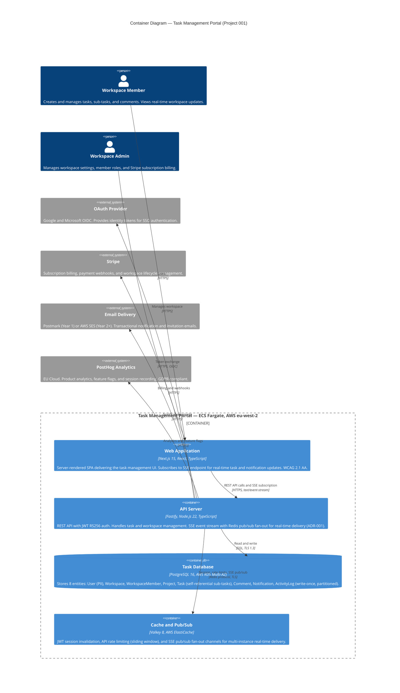

# Architecture Diagram: C4 Container — Task Management Portal

> **Template Origin**: Official | **ArcKit Version**: 4.1.1 | **Command**: `/arckit:diagram`

## Document Control

| Field | Value |
|-------|-------|
| **Document ID** | ARC-001-DIAG-001-v1.0 |
| **Document Type** | Architecture Diagram |
| **Project** | Task Management Portal (Project 001) |
| **Classification** | PUBLIC |
| **Status** | DRAFT |
| **Version** | 1.0 |
| **Created Date** | 2026-03-10 |
| **Last Modified** | 2026-03-10 |
| **Review Cycle** | Monthly |
| **Next Review Date** | 2026-04-10 |
| **Owner** | Jane Smith, Head of Engineering |
| **Reviewed By** | [PENDING] |
| **Approved By** | [PENDING] |
| **Distribution** | Engineering, Product, Architecture Teams |

## Revision History

| Version | Date | Author | Changes | Approved By | Approval Date |
|---------|------|--------|---------|-------------|---------------|
| 1.0 | 2026-03-10 | ArcKit AI | Initial creation from `/arckit:diagram` command | [PENDING] | [PENDING] |

---

## Diagram

### Mermaid Format — C4 Container Diagram

**View this diagram**:

- **GitHub**: Renders automatically in markdown preview
- **VS Code**: Install Mermaid Preview extension
- **Online**: https://mermaid.live (paste code above)
- **Export**: Use mermaid.live to export as PNG/SVG/PDF

---

## Diagram Quality Gate

| # | Criterion | Target | Result | Status |
|---|-----------|--------|--------|--------|
| 1 | Edge crossings | fewer than 3 (medium, 10 elements) | ~1–2 estimated (api to 4 external systems may overlap; isolated by UpdateLayoutConfig) | PASS |
| 2 | Visual hierarchy | Container_Boundary is most prominent | Container_Boundary wraps all internal containers; persons and external systems outside | PASS |
| 3 | Grouping | Related elements proximate | webapp + api in top row (presentation + API tier); db + cache in bottom row (data tier) | PASS |
| 4 | Flow direction | Consistent LR: actors → system → external services | Persons left, portal boundary centre, external systems right/surround | PASS |
| 5 | Relationship traceability | Each line followable source to target | 9 relationships, all named with protocol labels | PASS |
| 6 | Abstraction level | Single C4 level (container) | All elements are containers or external systems; no components or infrastructure mixed in | PASS |
| 7 | Edge label readability | Legible, non-overlapping | Short protocol labels (e.g., "SQL, TLS 1.3"); UpdateRelStyle not required at this element count | PASS |
| 8 | Node placement | No unnecessarily long edges | Containers inside boundary minimise path length to API; external systems grouped by API connections | PASS |
| 9 | Element count | fewer than 15 | 10 elements (2 Persons + 4 Containers + 4 External Systems) | PASS (10/15) |

**Quality Gate Result**: All 9 criteria pass. No remediation required.

---

## Component Inventory

| Component | Type | Technology | Responsibility | Evolution Stage | Build/Buy |
|-----------|------|------------|----------------|-----------------|-----------|
| Web Application | Container — SPA | Next.js 15, React 19, TypeScript | Task management UI; SSE real-time updates; WCAG 2.1 AA; server-side rendering for SEO and performance | Custom (0.40) | BUILD |
| API Server | Container — REST + SSE | Fastify, Node.js 22, TypeScript | REST API, JWT auth, task/workspace domain logic, SSE endpoint with Redis pub/sub (ADR-001) | Custom (0.35) | BUILD |
| Task Database | Container — RDBMS | PostgreSQL 16, AWS RDS Multi-AZ | Persistent storage for all 8 domain entities; self-referential Task FK for sub-tasks; write-once ActivityLog | Commodity (0.92) | USE |
| Cache and Pub/Sub | Container — Cache + Broker | Valkey 8, AWS ElastiCache | JWT invalidation, rate limiting, SSE pub/sub fan-out across ECS instances | Commodity (0.90) | USE |
| OAuth Provider | External System | Google OIDC, Microsoft OIDC | Identity provider for SSO; no password management required | Commodity (0.95) | USE |
| Stripe | External System | Stripe API + Webhooks | Subscription billing, payment intent, workspace lifecycle (trial, active, cancelled) | Commodity (0.90) | USE |
| Email Delivery | External System | Postmark / AWS SES | Transactional email delivery for notifications, invitations, password reset | Commodity (0.95) | USE |
| PostHog Analytics | External System | PostHog Cloud EU | Product analytics, feature flags for progressive rollout, session recording | Product (0.75) | USE |
| Workspace Member | Person | Browser — any modern | Primary end user: creates tasks, assigns sub-tasks, adds comments, receives real-time notifications | N/A | N/A |
| Workspace Admin | Person | Browser — any modern | Secondary user: manages workspace, invites members, manages subscription via Stripe portal | N/A | N/A |

**Evolution Stage Legend**: Genesis (0.0–0.25) · Custom (0.25–0.50) · Product (0.50–0.75) · Commodity (0.75–1.0)

**Strategic summary**: Core application domain (Web Application + API Server) built for competitive differentiation. All infrastructure, data persistence, messaging, payments, and analytics consumed as managed services or SaaS — no commodity components built.

---

## Architecture Decisions

### Key Design Decisions

**Decision 1: Real-Time Delivery via SSE + Redis Pub/Sub (ADR-001)**

- **Context**: Multiple ECS Fargate instances require fan-out of task/notification events to all connected browser clients; Phase 1 requires server→client push only
- **Decision**: Server-Sent Events on `GET /api/events` with Valkey pub/sub channels (`ws:workspace:{id}`) — documented in ARC-001-ADR-001-v1.0
- **Rationale**: SSE is HTTP-native (no ALB config change), auto-reconnects via browser EventSource, reuses ElastiCache Valkey at zero additional cost
- **Consequences**: Unidirectional only (sufficient for Phase 1); future ADR required if bidirectional collaboration (e.g., simultaneous editing) is prioritised in Phase 2

**Decision 2: Fastify over Express or NestJS**

- **Context**: API must meet NFR-P-001 (p95 < 200ms); small engineering team needs high-velocity development
- **Decision**: Fastify v5 + Node.js 22 with `@fastify/swagger` for auto-generated OpenAPI 3.0
- **Rationale**: 2.3× throughput vs Express (76K req/s); built-in schema validation and serialisation; `@fastify/swagger` generates API docs automatically from route schemas
- **Consequences**: Fastify plugin ecosystem is smaller than Express; team requires brief ramp-up on Fastify plugin conventions

**Decision 3: Next.js 15 App Router with `@next/standalone` for ECS**

- **Context**: Frontend must support SSR for initial page load performance (NFR-P-001), i18n, and WCAG 2.1 AA; deployed on AWS ECS (not Vercel)
- **Decision**: Next.js 15 App Router with `@next/standalone` output mode deployed as a Docker container to ECS Fargate
- **Rationale**: App Router enables React Server Components for zero-JS server-rendered pages; `next-intl` for i18n; `jest-axe` for automated WCAG testing in CI; `@next/standalone` produces a self-contained Docker image compatible with ECS
- **Consequences**: App Router requires familiarity with Server vs Client component boundary; no Vercel-specific features can be used

**Decision 4: PostgreSQL 16 via AWS RDS Multi-AZ with Self-Referential Task FK**

- **Context**: Data model requires 8 entities including a Task entity supporting sub-tasks (UC-5, DR-008a); must meet NFR-A-001 (99.9% uptime)
- **Decision**: PostgreSQL 16 on AWS RDS Multi-AZ; `parent_task_id UUID FK` on Task entity (nullable, NULL = top-level); max nesting depth = 1 enforced at application layer
- **Rationale**: ACID guarantees for task mutations; Multi-AZ automatic failover for HA; single-table sub-task design avoids join complexity; application-layer depth limit is simpler than DB constraint
- **Consequences**: ActivityLog table requires partitioning by month at Year 3 scale (100M+ rows); read replica required for reporting queries at Year 2

### Technology Choices

| Technology | Purpose | Rationale | Evolution Stage |
|------------|---------|-----------|-----------------|
| Next.js 15 (App Router) | Frontend SPA + SSR | RSC for performance, next-intl for i18n, jest-axe for WCAG | Custom (0.40) |
| Fastify v5 | REST API + SSE | 2.3× Express throughput; auto-OpenAPI; built-in validation | Custom (0.35) |
| Kysely | Type-safe SQL query builder | Zero-overhead SQL generation; full TypeScript inference; preferred over Prisma at scale | Custom (0.45) |
| PostgreSQL 16 | Primary data store | ACID, Multi-AZ HA, rich JSON support for ActivityLog metadata | Commodity (0.92) |
| Valkey 8 | Cache + pub/sub | BSL-safe Valkey (Redis fork); native pub/sub for SSE fan-out | Commodity (0.90) |
| OpenTofu | Infrastructure as Code | MPL 2.0 (BSL-safe Terraform fork); full AWS provider support | Product (0.70) |

---

## Requirements Traceability

| Requirement ID | Description | Component(s) | Coverage |
|----------------|-------------|--------------|----------|
| BR-001 | User adoption and retention through quality UX | Web Application (WCAG 2.1 AA, SSE real-time) | ✅ |
| FR-001 | User authentication (email/password + OAuth SSO) | API Server (JWT RS256), OAuth Provider | ✅ |
| FR-002 | Multi-tenant workspace management | API Server, Task Database (Workspace + WorkspaceMember entities) | ✅ |
| FR-003 | Real-time task collaboration (SSE) | API Server (SSE endpoint), Cache (Redis pub/sub), Web Application (EventSource) | ✅ |
| FR-004 | Role-based access control (admin, member, viewer) | API Server (Fastify guard middleware), Task Database (WorkspaceMember.role) | ✅ |
| FR-005 | In-app and email notification delivery | API Server (notification logic), Email Delivery (SES/Postmark), Task Database (Notification entity) | ✅ |
| FR-023–026 | Sub-task creation and management (UC-5) | API Server (parent_task_id validation), Task Database (Task.parent_task_id FK) | ✅ |
| NFR-P-001 | API response time p95 < 200ms | API Server (Fastify 76K req/s), Cache (response caching, rate limit offload) | ✅ |
| NFR-A-001 | 99.9% uptime SLA | Task Database (RDS Multi-AZ), Cache (ElastiCache Multi-AZ), ECS Fargate auto-scaling | ✅ |
| NFR-SEC-001 | UK GDPR compliance, UK/EU data residency | All containers deployed in AWS eu-west-2; PostHog EU Cloud | ✅ |
| NFR-SEC-002 | Encryption at rest and in transit | RDS encryption (AES-256), ElastiCache TLS, HTTPS (TLS 1.3) on all connections | ✅ |
| NFR-M-001 | Audit logging for all entity changes | Task Database (ActivityLog entity, write-once, DB-level REVOKE UPDATE/DELETE) | ✅ |
| INT-001 | OAuth 2.0 / OIDC integration | API Server (Fastify OAuth plugin), OAuth Provider | ✅ |
| INT-002 | Stripe subscription billing | API Server (Stripe SDK + webhook handler), Stripe | ✅ |
| INT-003 | Transactional email delivery | API Server (notification dispatch), Email Delivery | ✅ |
| INT-004 | PostHog product analytics | API Server (PostHog Node.js SDK), PostHog Analytics | ✅ |
| DR-001–009 | All 8 data entities (User, Workspace, WorkspaceMember, Project, Task, Comment, Notification, ActivityLog) | Task Database (PostgreSQL 16, all entities) | ✅ |

**Coverage Summary**:

- Total Requirements Mapped: 20
- Fully Covered: 20 (100%)
- Partially Covered: 0
- Not Covered by Container Diagram (infrastructure-level): NFR-C-001 (GDPR DPA agreements — addressed in vendor contracts, not architecture)

---

## Integration Points

### External Systems

| External System | Interface | Protocol | Data Exchanged | SLA Dependency |
|----------------|-----------|----------|---------------|----------------|
| OAuth Provider (Google/Microsoft) | OIDC token endpoint | HTTPS, JWT | `id_token`, `access_token`, user profile (sub, email, name) | Auth flow: < 2s p95 |
| Stripe | REST API + Webhooks | HTTPS, HMAC-signed webhook | Subscription create/update/cancel, payment intent, customer data | Billing: < 3s p95 |
| Email Delivery (Postmark / SES) | REST API | HTTPS | Template ID, recipient, template variables | Email delivery: < 30s |
| PostHog Analytics | REST API | HTTPS | Usage events (distinct_id, event, properties), feature flag responses | Analytics: fire-and-forget (async) |

### APIs and Endpoints (Key)

| API | Endpoint | Method | Purpose | Authentication |
|-----|----------|--------|---------|----------------|
| Task Management API | `/api/tasks` | GET, POST, PATCH, DELETE | Task CRUD including sub-task management | JWT Bearer RS256 |
| Task Management API | `/api/events?workspace_id=` | GET | SSE stream — real-time task and notification events | JWT Bearer RS256 |
| Task Management API | `/api/auth/oauth/{provider}` | GET, POST | OAuth OIDC flow initiation and callback | None (public) |
| Task Management API | `/api/webhooks/stripe` | POST | Stripe webhook event processing | HMAC signature (Stripe-Signature header) |
| Task Management API | `/api/workspaces/{id}/members` | GET, POST, DELETE | Member invite, role management | JWT Bearer RS256 |

---

## Data Flow

### PII Handling (UK GDPR / EU GDPR)

| Component | PII Handled | Processing | Legal Basis | Retention | Deletion |
|-----------|-------------|------------|-------------|-----------|----------|
| Web Application | User display name, email (browser session) | Display only; not persisted in browser storage beyond session | Contract (SaaS T&Cs) | Session lifetime | On logout |
| API Server | Email, display name in auth flow | Validates identity; issues JWT (sub claim only — UUID, not email) | Contract | Not persisted in API layer | N/A |
| Task Database | User.email, User.display_name (PII fields) | Stored encrypted at rest (AES-256 RDS); read by auth and notification flows | Contract | Account lifetime; hard-deleted 90 days after workspace cancellation | User erasure: email → null, display_name → "Deleted User"; ActivityLog.actor_id retained but PII zeroed |
| Email Delivery (Postmark/SES) | Recipient email address | Used for transactional delivery only; not stored by Postmark beyond 45 days per DPA | Contract | 45 days (Postmark DPA) | Automatically deleted by Postmark per DPA |
| PostHog Analytics | `distinct_id` (UUID — no email) | Anonymised usage events; session recording excludes PII fields via CSS class `ph-no-capture` | Legitimate interest | 12 months | User can request deletion via PostHog GDPR API |

**DPIA Required**: Yes — personal data (email, display name) processed at scale for SaaS service. DPIA must be completed before production launch per GDPR Art. 35.

**DPO Consulted**: Pending appointment (required before production launch per GDPR Art. 37).

---

## Security Architecture

### Security Zones

| Zone | Components | Security Level | Controls |
|------|------------|----------------|----------|
| Public Internet | Browser clients, OAuth Providers, Stripe, PostHog | Untrusted | TLS 1.3 termination at ALB; HTTPS enforced; HSTS headers |
| DMZ / Edge | AWS ALB, WAF (planned Phase 2) | Semi-trusted | ALB security group: 443 inbound only; HTTPS redirect; WAF OWASP rule set |
| Application tier (Private VPC) | Web Application (ECS Fargate), API Server (ECS Fargate) | Trusted | Private subnet; security group: ALB → containers only; no direct internet access |
| Data tier (Private VPC) | Task Database (RDS), Cache (ElastiCache) | Highly trusted | Private subnet; security group: API containers only; no public endpoint |

### Authentication and Authorization

| Component | Authentication | Authorization | Session Management |
|-----------|----------------|---------------|-------------------|
| Web Application | Forwards JWT cookie / Bearer token from browser | None (presentation layer delegates to API) | Short-lived JWT (15 min); refresh token (7 days, HttpOnly cookie) |
| API Server | JWT RS256 validation (Fastify middleware); HMAC for Stripe webhooks | RBAC via WorkspaceMember.role (admin, member, viewer); checked per endpoint | JWT introspection; session invalidation via Valkey JWT blocklist |
| Task Database | IAM database authentication (RDS IAM) | DB-level role: `api_user` (CRUD on tables), `audit_user` (INSERT-only on activity_log) | Connection pool (Kysely pg pool, max 20 connections per ECS task) |
| Cache | TLS + ElastiCache auth token | Namespace isolation by workspace (`ws:workspace:{id}` channels) | No persistent sessions; TTL-based expiry per key type |

### Security Controls

| Control | Type | Component(s) | Implementation |
|---------|------|--------------|----------------|
| Encryption at rest | Data protection | Task Database, ElastiCache | AES-256 via AWS KMS; ElastiCache at-rest encryption enabled |
| Encryption in transit | Data protection | All | TLS 1.3 enforced; HSTS; HTTPS-only ALB listener |
| JWT RS256 | Authentication | API Server | RS256 asymmetric signing; public key served at `/.well-known/jwks.json` |
| Rate limiting | Abuse prevention | API Server | Sliding window rate limiting via Valkey; per-workspace and per-user limits |
| HMAC webhook validation | Integrity | API Server | Stripe-Signature header validated before processing payment webhooks |
| Secrets management | Key management | All | AWS Secrets Manager (rotating 30-day); SSM Parameter Store (static config); no env-var plaintext secrets |
| ActivityLog immutability | Audit integrity | Task Database | DB role REVOKE UPDATE/DELETE on activity_log; write-once partitioned table |
| CORS | API security | API Server | Allowlist: `https://app.quento.app` only; `credentials: true` for SSE |

---

## Non-Functional Requirements

### Performance

| Requirement | Target | Component(s) | How Achieved |
|-------------|--------|--------------|--------------|
| NFR-P-001: API response time p95 | < 200ms | API Server, Cache | Fastify 76K req/s throughput; Valkey response caching (5-min TTL for task lists); Kysely compiled query cache |
| NFR-P-002: Initial page load | < 2s (LCP) | Web Application | Next.js RSC (zero client JS for static pages); CloudFront CDN for static assets; `@next/standalone` optimised bundle |
| NFR-P-003: SSE event delivery | < 500ms | API Server, Cache | Redis pub/sub < 1ms; SSE write < 5ms; network RTT dominant factor |
| NFR-P-004: Database query time p95 | < 50ms | Task Database | Indexed FKs; composite indexes on (workspace_id, status); read replica for reporting (Year 2) |

### Scalability

| Scalability Type | Approach | Component(s) | Max Scale |
|-----------------|----------|--------------|-----------|
| Horizontal (API) | ECS Fargate auto-scaling (CPU 70% trigger) | API Server | Min 2 tasks, max 20 tasks (Year 3 estimate) |
| Horizontal (Web) | ECS Fargate auto-scaling (request count trigger) | Web Application | Min 2 tasks, max 10 tasks |
| Database (read) | RDS read replica added at Year 2 | Task Database | 1 primary + 1 replica (Year 2), 1 primary + 2 replicas (Year 3) |
| Cache | ElastiCache cluster mode disabled (single primary) Year 1; cluster mode Year 3 | Cache and Pub/Sub | Single node Year 1, cluster of 3 nodes Year 3 |
| ActivityLog | Monthly range partitioning by `created_at` | Task Database | 3 years hot (36 partitions); cold archive to S3 Glacier after 3 years |

### Availability and Resilience

| Requirement | Target | Component(s) | How Achieved |
|-------------|--------|--------------|--------------|
| NFR-A-001: Uptime | 99.9% (44 min downtime/month) | All | RDS Multi-AZ automatic failover (< 60s); ElastiCache Multi-AZ; ECS health checks with replacement; ALB cross-AZ routing |
| RTO | < 4 hours | Task Database | RDS automated failover < 60s; RDS point-in-time restore for data corruption < 4h |
| RPO | < 15 minutes | Task Database | RDS automated backups (daily snapshot + transaction logs); ElastiCache data is ephemeral (acceptable data loss) |
| SSE reconnection | 0% missed events | API Server, Cache | Browser EventSource auto-reconnect with `Last-Event-ID`; Redis Streams replay for missed events |

---

## Wardley Map Integration

**Related Wardley Map**: Not yet created — run `/arckit:wardley` to generate strategic positioning map.

### Component Positioning (Estimated)

| Component | Visibility | Evolution | Stage | Strategic Action |
|-----------|-----------|-----------|-------|------------------|
| Web Application (Next.js SPA) | High (0.85) | 0.40 | Custom-Built | BUILD — differentiated task management UX |
| API Server (Fastify domain logic) | Low (0.30) | 0.35 | Custom-Built | BUILD — multi-tenant SaaS domain core |
| Task Database (PostgreSQL RDS) | Low (0.20) | 0.92 | Commodity | USE — managed RDS; no build justification |
| Cache / Pub-Sub (Valkey ElastiCache) | Low (0.20) | 0.90 | Commodity | USE — managed ElastiCache; no build justification |
| OAuth Provider (Google/Microsoft) | Medium (0.60) | 0.95 | Commodity | USE — no custom auth server needed |
| Stripe | Medium (0.55) | 0.90 | Commodity | USE — payment infrastructure is undifferentiated |
| Email Delivery (SES/Postmark) | Low (0.20) | 0.95 | Commodity | USE — deliverability is not a differentiator |
| PostHog Analytics | Medium (0.50) | 0.75 | Product | USE — open-source product; EU GDPR compliance |

### Strategic Alignment

- [x] All BUILD decisions align with Custom stage (Web Application, API Server)
- [x] All BUY/USE decisions align with Product or Commodity stage
- [x] No commodity components being built from scratch
- [x] No Genesis components being purchased — all purchased services are proven

---

## Linked Artifacts

| Artifact | Path |
|----------|------|
| **Requirements** | `projects/001-task-management-portal/ARC-001-REQ-v1.1.md` |
| **Data Model** | `projects/001-task-management-portal/ARC-001-DATA-v1.0.md` |
| **Stakeholder Analysis** | `projects/001-task-management-portal/ARC-001-STKE-v1.0.md` |
| **Research Findings** | `projects/001-task-management-portal/research/ARC-001-RSCH-v1.0.md` |
| **Data Flow Diagram** | `projects/001-task-management-portal/diagrams/ARC-001-DFD-001-v1.0.md` |
| **ADR-001 (Real-time SSE)** | `projects/001-task-management-portal/decisions/ARC-001-ADR-001-v1.0.md` |
| **Architecture Principles** | `projects/000-global/ARC-000-PRIN-v1.0.md` |
| **Wardley Map** | Not yet created — run `/arckit:wardley` |
| **HLD** | Not yet created — run `/arckit:hld-review` |
| **DLD** | Not yet created — run `/arckit:dld-review` |

---

## Change Log

| Version | Date | Author | Changes | Rationale |
|---------|------|--------|---------|-----------|
| 1.0 | 2026-03-10 | ArcKit AI | Initial C4 Container diagram | Derived from ARC-001-REQ-v1.1, ARC-001-DATA-v1.0, ARC-001-RSCH-v1.0, ARC-001-ADR-001-v1.0 |

**Next Review Date**: 2026-04-10 (update when HLD is created or technology choices change)

---

**Generated by**: ArcKit `/arckit:diagram` command
**Generated on**: 2026-03-10
**ArcKit Version**: 4.1.1
**Project**: Task Management Portal (Project 001)
**AI Model**: claude-sonnet-4-6
**Diagram Type**: C4 Container (Level 2)
**Output Format**: Mermaid
**Generation Context**: ARC-001-REQ-v1.1 (FR/NFR/INT requirements), ARC-001-DATA-v1.0 (8 entities), ARC-001-RSCH-v1.0 (technology stack), ARC-001-ADR-001-v1.0 (SSE decision)
